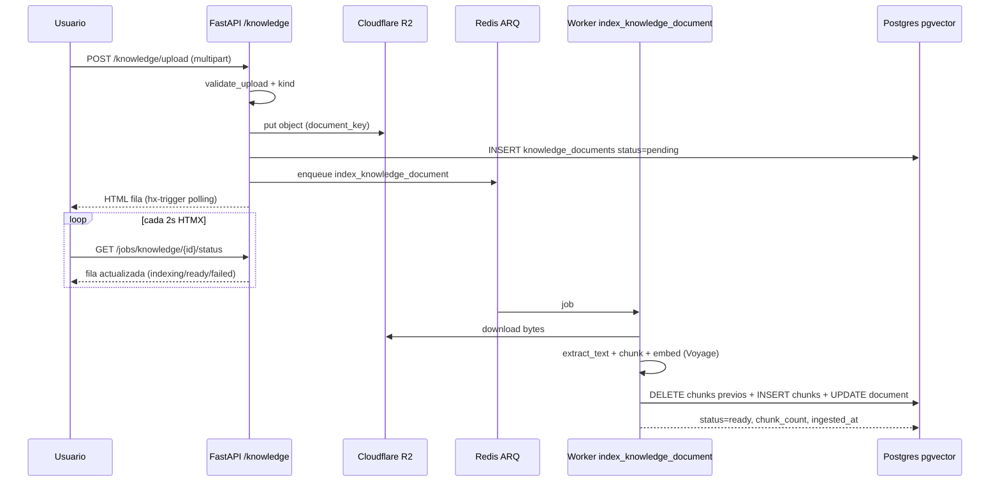

# Paso 18 — Ingesta de documentos de conocimiento (módulo 2 · fase ingesta)

## Objetivo

Implementar la **ingesta** de la base de conocimiento de la empresa en `/knowledge`: contratos, condiciones generales, horarios, servicios ofertados, políticas internas, manuales y FAQs en PDF o texto plano.

Al final del paso, un usuario autenticado puede:

1. Subir uno o varios ficheros desde `/knowledge`.
2. Ver el listado con estado (`pending` → `indexing` → `ready` / `failed`).
3. Tener el contenido **extraído, troceado (chunking) y embebido** en Postgres (`pgvector`) de forma asíncrona vía ARQ.
4. Consultar metadatos del documento (nombre, categoría, nº de chunks, fecha de indexación).

Este paso **no** activa aún la consulta conversacional RAG ni las tools `knowledge_*` del chat (Paso 19–20). Solo construye el **pipeline de ingesta y el almacén vectorial**.

## Pre-requisitos

- Pasos **01–16** completados (auth, R2, ARQ, extracción módulo 1, chat documental con `ToolRegistry`).
- Postgres local con extensión **pgvector** (`docker/postgres/init.sql` ya la crea).
- Redis y worker ARQ operativos.
- **Infisical** con claves LLM ya configuradas; en este paso se añade **`VOYAGE_API_KEY`** (embeddings).
- Paso 16 deja stubs de tools `knowledge` deshabilitados — **mantener** `knowledge_tools_enabled=False` hasta Paso 19.

## Contexto relevante

| Documento | Sección |
|-----------|---------|
| `arquitectura.md` | §1 módulo 2, §5 (`documents` / `chunks`), §6 módulo 2 (ingesta), §8 (`embed`, `voyage-3-lite`), §10 (ARQ + polling HTMX) |
| `Agents.md` | Capas, RLS, prompts versionados, no JSON en `routes/web/`, secretos vía Infisical |
| `Paso16.md` | `ToolRegistry` con familia `knowledge` (stubs); chat unificado planificado en Paso 20+ |
| Código existente | `app/core/keys.py` → `document_key()` (prefijo R2 `documents/`), `app/core/document_text.py` → extracción PDF con `pypdf`, `knowledge_tools_enabled` en `app/config.py`, stubs en `app/llm/tools/document_chat.py` |

## Alcance

### Dentro de Paso 18

- Modelos ORM + migración Alembic con RLS.
- Validación de subida (MIME, tamaño, magic bytes).
- UI `/knowledge`: listado, subida HTMX, fila con polling de estado.
- Worker ARQ `index_knowledge_document`.
- Extracción de texto (PDF digital + `.txt` / `.md`).
- Chunking (~500–800 tokens, solape ~100).
- Embeddings con **Voyage `voyage-3-lite`** vía `LLMClient.embed()`.
- Índices HNSW (vector) + GIN (`tsvector`) en chunks.
- Audit log en subida, reindexación y borrado.
- Tests unitarios, integración y eval stub de calidad de chunking.

### Fuera de Paso 18 (pasos posteriores)

- Tools `search_knowledge`, `list_knowledge_sources`, `get_knowledge_chunk` (Paso 19).
- Búsqueda híbrida en runtime (RRF denso + BM25) consumida por el chat (Paso 19).
- Activar `knowledge_tools_enabled=True` y prompt `chat_unified_v1.txt` (Paso 20).
- Ingesta por **URL** (scraping), editor manual de FAQ, WhatsApp, reranker externo.
- **Contextual retrieval** (enriquecer cada chunk con una línea de contexto vía LLM) — sub-fase opcional al final del paso.
- OCR multimodal con LLM para PDFs escaneados — sub-fase opcional (fallback costoso).

## Principio de nomenclatura (evitar colisiones)

| Concepto | Ruta / nombre | Notas |
|----------|---------------|-------|
| Panel módulo 1 (facturas, tickets) | `/documents` | Ya existe; **no tocar** salvo enlace en sidebar |
| Base de conocimiento RAG | `/knowledge` | Nueva UI del módulo 2 |
| Tabla BD fuentes RAG | `knowledge_documents` | En `arquitectura.md` §5 aparece como `documents`; usamos prefijo `knowledge_` en BD para no confundir con el panel `/documents` |
| Tabla BD fragmentos | `knowledge_chunks` | Idem; alinea con `arquitectura.md` `chunks` |
| Modelos Python | `KnowledgeDocument`, `KnowledgeChunk` | En `app/models/knowledge.py` |
| Prefijo R2 | `documents/{tenant_id}/…` | Ya definido en `document_key()` |
| Job ARQ | `index_knowledge_document` | Distinto de `process_invoice` / `process_ticket` |

> **Tarea de documentación:** al implementar, actualizar `arquitectura.md` §5 pseudo-DDL con nombres `knowledge_documents` / `knowledge_chunks` o añadir nota de alias.

## Categorías de conocimiento (MVP)

Etiqueta obligatoria en subida (`kind`). Valores iniciales (`KnowledgeDocumentKind` StrEnum):

| Código | Etiqueta UI | Ejemplos |
|--------|------------|----------|
| `contract` | Contrato | Contrato marco, SLA |
| `terms` | Condiciones | CGC, privacidad, cookies |
| `schedule` | Horario | Horario comercial, turnos |
| `services` | Servicios | Catálogo, tarifas, menú |
| `policy` | Política interna | Gastos, vacaciones, calidad |
| `faq` | FAQ | Preguntas frecuentes |
| `manual` | Manual / procedimiento | Onboarding empleado |
| `other` | Otro | Resto |

La categoría es **metadato de filtrado** en UI y futuras tools; no cambia el pipeline de indexación.

## Arquitectura del flujo de ingesta



### Estados del documento

```
pending → indexing → ready
                  ↘ failed
```

- **`pending`**: registro creado, job encolado.
- **`indexing`**: worker procesando (extracción / chunk / embed).
- **`ready`**: al menos un chunk persistido; `chunk_count > 0`.
- **`failed`**: error recuperable registrado en `error_message` + audit log.

Reindexación: mismo documento pasa a `indexing`, borra chunks anteriores del tenant y regenera.

## Tareas

### Fase A — Acciones manuales previas (usuario)

- [x] **A.1** Crear cuenta / proyecto en [Voyage AI](https://www.voyageai.com/) y obtener API key.
- [x] **A.2** Añadir en Infisical (entorno dev): `VOYAGE_API_KEY=<clave>`.
- [ ] **A.3** Preparar carpeta local `tests/fixtures/knowledge/` con al menos **5 documentos de prueba**:
  - [x] 1 PDF con texto seleccionable (contrato o condiciones, 2–10 páginas).
  - [x] 1 PDF corto de horario o servicios (1 página).
  - [x] 1 `.txt` o `.md` con FAQ (10–30 preguntas).
  - [x] 1 PDF **escaneado** (solo imagen) para probar fallo controlado en MVP.
  - [x] 1 fichero inválido (p. ej. `.exe` renombrado) para probar validación.
- [x] **A.4** Verificar Docker: `docker compose -f docker/docker-compose.yml up -d` (postgres + redis + langfuse).
- [x] **A.5** Confirmar extensión vector:
  `docker exec saas-postgres psql -U saas -d saas -c "SELECT extname FROM pg_extension WHERE extname = 'vector';"`
- [x] **A.6** (Opcional staging/prod) Replicar `VOYAGE_API_KEY` en Infisical staging/prod cuando toque desplegar.

### Fase B — Configuración y dependencias (código)

- [x] Ampliar `app/config.py` con settings de ingesta:

```python
# Knowledge / RAG ingesta (Paso 18)
knowledge_max_file_size_bytes: int = 15 * 1024 * 1024  # 15 MB
knowledge_chunk_target_tokens: int = 600
knowledge_chunk_overlap_tokens: int = 100
knowledge_embedding_model: str = "voyage-3-lite"
knowledge_embedding_dimensions: int = 1536
knowledge_index_max_concurrent_per_tenant: int = 3
knowledge_allowed_mimes: ...  # ver Fase D
knowledge_contextual_retrieval_enabled: bool = False  # sub-fase opcional
```

- [x] Documentar nuevas variables en `.env.example` (solo plantilla, **sin valores**).
- [x] Verificar `voyageai` en `pyproject.toml` (ya presente); no añadir LangChain.

### Fase C — Modelo de datos y migración

- [x] Crear `app/models/knowledge.py` — `KnowledgeDocument`, `KnowledgeChunk`, enums `KnowledgeDocumentStatus`, `KnowledgeDocumentKind`.
- [x] Migración Alembic `p18_knowledge_01`:
  - [x] Tabla `knowledge_documents` con RLS + `FORCE ROW LEVEL SECURITY`.
  - [x] Tabla `knowledge_chunks` con RLS.
  - [x] Columna `embedding vector(1536)` en chunks (tipo pgvector).
  - [x] Columna `search_vector tsvector` **generada** desde `content` (config `spanish` — castellano; documentado en cabecera de la migración).
  - [x] Índice **HNSW** sobre `embedding` (`vector_cosine_ops`).
  - [x] Índice **GIN** sobre `search_vector`.
  - [x] FK `knowledge_chunks.document_id → knowledge_documents.id ON DELETE CASCADE`.
  - [x] Índices: `(tenant_id, status)`, `(tenant_id, kind)`, `(tenant_id, document_id, position)`.
  - [x] `GRANT` a rol `saas_app` (mismo patrón que migraciones anteriores).
- [x] Exportar modelos en `app/models/__init__.py`.
- [x] Aplicar migración local: `infisical run -- uv run alembic upgrade head`.

#### Pseudo-DDL de referencia

```sql
knowledge_documents (
  id uuid pk,
  tenant_id uuid fk -> tenants,
  kind text not null,              -- KnowledgeDocumentKind
  name text not null,              -- título editable; default = filename
  original_filename text not null,
  source_file_key text not null,   -- R2
  source_mime text not null,
  status text not null,            -- pending | indexing | ready | failed
  chunk_count int default 0,
  error_message text null,
  file_size_bytes int not null,
  uploaded_by uuid fk -> users null,
  ingested_at timestamptz null,
  created_at timestamptz,
  updated_at timestamptz
)

knowledge_chunks (
  id uuid pk,
  tenant_id uuid fk -> tenants,
  document_id uuid fk -> knowledge_documents on delete cascade,
  content text not null,
  context text null,               -- contextual retrieval (opcional)
  embedding vector(1536) not null,
  search_vector tsvector generated always as (to_tsvector('spanish', content)) stored,
  metadata jsonb default '{}',     -- page_no, char_start, token_estimate
  position int not null,
  created_at timestamptz
)
```

### Fase D — Validación de subida

- [x] Crear `app/core/knowledge_uploads.py` (o ampliar `uploads.py` con sección clara):
  - [x] MIME permitidos MVP: `application/pdf`, `text/plain`, `text/markdown`, `text/x-markdown`.
  - [x] Magic bytes (reutilizar patrón de `app/core/uploads.py`).
  - [x] Tamaño máximo desde settings.
  - [x] Nombre original saneado (mismo helper que facturas).
- [x] Ampliar `app/core/document_text.py`:
  - [x] Soporte `text/plain` y `text/markdown` (decode UTF-8 con fallback `replace`).
  - [x] PDF: mantener `pypdf`; registrar warning si texto vacío (`scanned_pdf_suspected`).
  - [x] Función pública `extract_knowledge_text(file_bytes, mime_type) -> ExtractedTextResult` con `char_count`, `page_count?`, `warnings[]`.

### Fase E — Chunking y embeddings (capa `llm/` + `core/`)

- [x] Crear `app/core/text_chunking.py`:
  - [x] Estimación tokens (~4 chars/token es suficiente para MVP).
  - [x] Split por párrafos con solape configurable.
  - [x] Preservar metadatos `position`, `page_no` cuando el extractor lo permita.
- [x] Crear `app/llm/embeddings.py`:
  - [x] Cliente Voyage async (`voyageai.AsyncClient`).
  - [x] Batch de textos (límite API: trocear en lotes de p. ej. 64).
  - [x] Normalización L2 aplicada (Voyage devuelve vectores sin normalizar; normalización necesaria para `vector_cosine_ops` en HNSW).
- [x] Ampliar `app/llm/client.py`:
  - [x] Añadir `TaskType` literal `"embedding"` si aún no está.
  - [x] Método `async def embed(self, texts: list[str], *, tenant_id: UUID, db: AsyncSession) -> list[list[float]]`.
  - [x] Persistir cada batch en `llm_calls` con `task='embedding'`, modelo, tokens, coste, latencia.
  - [x] Trazas Langfuse (span por batch bajo trace_id compartido del embed() call).
- [x] (Opcional sub-fase) Prompt `knowledge_context_v1.txt` creado como stub. Lógica no implementada (`knowledge_contextual_retrieval_enabled=False` por defecto).

### Fase F — Servicios de dominio

- [x] Crear `app/schemas/knowledge.py` — `KnowledgeDocumentCreate`, `KnowledgeDocumentRead`, `KnowledgeChunkRead`, filtros de listado.
- [x] Crear `app/services/knowledge_document_service.py`:
  - [x] `create_from_upload()` — sube R2, inserta fila `pending`, audit log.
  - [x] `list_documents()` — paginación, filtro por `kind` y `status`.
  - [x] `get_document()` — detalle + presigned URL de descarga (solo admin/member).
  - [x] `mark_indexing()` / `apply_index_result()` / `mark_failed()`.
  - [x] `delete_document()` — borra R2 + cascada chunks + audit log.
  - [x] `request_reindex()` — status → `pending`, encola job.
- [x] Crear `app/services/knowledge_index_service.py` — orquestación pura del pipeline:
  1. Descargar bytes de R2.
  2. `extract_knowledge_text`.
  3. Validar texto no vacío (si vacío → `failed` con código `empty_text`).
  4. Chunking.
  5. `LLMClient.embed`.
  6. Transacción: delete chunks del documento + bulk insert chunks.
  7. Actualizar documento (`ready`, `chunk_count`, `ingested_at`).
- [x] Semáforo Redis por tenant (patrón `app/jobs/invoice_slots.py`): máx. **3** indexaciones concurrentes por tenant.

### Fase G — Jobs ARQ

- [x] Crear `app/jobs/knowledge_jobs.py` — `index_knowledge_document(ctx, document_id, tenant_id)`.
- [x] Registrar en `app/jobs/settings.py` → `functions = [..., index_knowledge_document]`.
- [x] Crear `enqueue_knowledge_indexing()` en `app/jobs/queue.py` con `_job_id=f"knowledge:{document_id}"`.
- [x] Timeout job: **600 s** (embeddings de documentos largos).
- [ ] **Acción manual:** reiniciar worker tras desplegar código nuevo:
  `infisical run -- uv run arq app.jobs.settings.WorkerSettings`

### Fase H — Rutas web + polling HTMX

- [x] Crear `app/routes/web/knowledge.py`:
  - [x] `GET /knowledge` — página listado + zona de subida.
  - [x] `GET /knowledge/rows` — fragmento tabla (filtros kind/status vía query params).
  - [x] `POST /knowledge/upload` — multipart (`files[]`, `kind` por fichero o global).
  - [x] `GET /knowledge/{document_id}` — panel detalle (fragmento): metadatos, chunk_count, error, enlace descarga.
  - [x] `POST /knowledge/{document_id}/reindex` — hx-confirm.
  - [x] `DELETE /knowledge/{document_id}` — hx-confirm destructivo.
- [x] Ampliar `app/routes/web/jobs.py`:
  - [x] `GET /jobs/knowledge/{document_id}/status` → `components/knowledge_row.html`.
- [x] Registrar router en `app/main.py`.
- [x] Patrón `render()` página/fragmento en todos los endpoints.

### Fase I — Frontend (Jinja + HTMX + Alpine)

- [x] Añadir entrada sidebar: `("/knowledge", "Conocimiento", "book")` en `components/sidebar.html`.
- [x] Crear icono `components/icons/book.html` (o reutilizar existente).
- [x] `pages/knowledge/index.html` — layout dashboard con:
  - [x] Selector de categoría (`kind`) en subida.
  - [x] Dropzone (reutilizar patrón de `upload_modal.html` / `/documents`).
  - [x] Tabla con columnas: nombre, categoría, estado, chunks, fecha, acciones.
- [x] Componentes:
  - [x] `components/knowledge_upload_form.html`
  - [x] `components/knowledge_row.html` (con `hx-trigger="every 2s"` si `pending|indexing`)
  - [x] `components/knowledge_detail_panel.html`
  - [x] `components/knowledge_kind_badge.html`
- [x] Copy UI claro: **«Base de conocimiento»** — distinto de **«Documentos»** (facturas/tickets).
- [x] Compilar Tailwind si hay clases nuevas: `./scripts/tailwind_watch.sh` o build equivalente.

### Fase J — Guardrails, observabilidad y tests

- [x] Audit log: acciones `knowledge.upload`, `knowledge.index`, `knowledge.reindex`, `knowledge.delete`, `knowledge.index_failed`.
- [x] Rate-limit subidas: 20 documentos/día/tenant (Redis `rate:knowledge_upload:{tenant_id}:{date}`, setting `knowledge_max_uploads_per_day`, `app/core/rate_limiter.py`).
- [x] No exponer `embedding` raw en HTML ni en fragmentos HTMX (`KnowledgeChunkRead` excluye el campo embedding).
- [x] Unit: chunking (tamaño, solape, posiciones) → `tests/unit/test_text_chunking.py`.
- [x] Unit: validación MIME/tamaño → `tests/unit/test_knowledge_uploads.py`.
- [x] Unit: `extract_knowledge_text` con fixtures PDF/txt → `tests/unit/test_document_text.py`.
- [x] Unit: servicio index con mocks de R2 + Voyage → `tests/unit/test_knowledge_index_service.py`.
- [x] Integración: upload → encola job → worker inline → `ready` + chunks > 0 → `tests/integration/test_knowledge_worker.py`.
- [x] Integración RLS: tenant A no ve documentos de tenant B → `tests/integration/test_knowledge_rls.py`.
- [x] Integración: PDF escaneado → `failed` con mensaje UI comprensible → `tests/integration/test_knowledge_rls.py`.
- [x] Eval stub: `app/evals/datasets/knowledge_chunking_v1.json` + runner `app/evals/runners/knowledge_chunking.py`.
- [X] `mypy --strict` y `ruff check` verdes.
- [ ] Commit: `feat: knowledge document ingestion pipeline with pgvector indexing`.

## Detalles técnicos

### Extracción de texto (MVP vs futuro)

| Tipo fichero | MVP Paso 18 | Futuro |
|--------------|-------------|--------|
| PDF digital (capa texto) | `pypdf` vía `document_text.py` | — |
| TXT / MD | UTF-8 directo | — |
| PDF escaneado | `failed` + hint «sube versión con texto o contacta soporte» | OCR LLM multimodal (sub-fase) |
| DOCX | Fuera de MVP | `python-docx` o conversión server-side |
| URL | Fuera de MVP | Job `index_knowledge_url` |

### Chunking (valores por defecto)

- **Objetivo:** 600 tokens (~2400 caracteres).
- **Solape:** 100 tokens (~400 caracteres).
- **Mínimo chunk:** 80 tokens; fragmentos menores se fusionan con el anterior.
- **Máximo chunks por documento:** 500 (protección coste); si se supera → `failed` con `too_many_chunks`.

### Embeddings

- Modelo: **`voyage-3-lite`** (1536 dimensiones) — alineado con `arquitectura.md` §8.
- Task en `llm_calls`: `embedding`.
- Coste estimado vía `app/llm/pricing.py` (entrada ya tiene fila `voyage-3-lite`).

### Índices Postgres

En la migración, crear explícitamente:

```sql
CREATE INDEX knowledge_chunks_embedding_hnsw_idx
  ON knowledge_chunks USING hnsw (embedding vector_cosine_ops);

CREATE INDEX knowledge_chunks_search_vector_gin_idx
  ON knowledge_chunks USING gin (search_vector);
```

La **consulta híbrida** (cosine + BM25 + RRF) se implementa en **Paso 19**; aquí solo se preparan columnas e índices.

### Worker — pseudocódigo

```python
async def index_knowledge_document(ctx: dict, document_id: str, tenant_id: str) -> dict:
    async with session_factory_for_worker(UUID(tenant_id)) as db:
        doc = await knowledge_document_service.get_document(db, UUID(tenant_id), UUID(document_id))
        await knowledge_document_service.mark_indexing(db, doc)
        await db.commit()
        try:
            async with knowledge_index_slot(UUID(tenant_id)):
                result = await knowledge_index_service.run_index_pipeline(db, doc)
            await knowledge_document_service.apply_index_result(db, doc, result)
        except Exception as exc:
            await knowledge_document_service.mark_failed(db, doc, error=str(exc)[:500])
            raise
        await db.commit()
    return {"document_id": document_id, "status": "ready", "chunks": result.chunk_count}
```

### Permisos (MVP)

| Acción | Rol mínimo |
|--------|------------|
| Ver listado / detalle | `member` |
| Subir / reindexar | `member` |
| Borrar | `admin` |

Usar `require_role("admin")` en DELETE; resto con membership activa.

## Estructura de ficheros nueva

```
app/
  models/knowledge.py
  schemas/knowledge.py
  core/knowledge_uploads.py
  core/text_chunking.py
  core/document_text.py          # ampliado
  llm/embeddings.py
  llm/client.py                  # + embed()
  services/knowledge_document_service.py
  services/knowledge_index_service.py
  jobs/knowledge_jobs.py
  jobs/queue.py                  # + enqueue_knowledge_indexing
  jobs/settings.py               # + index_knowledge_document
  routes/web/knowledge.py
  routes/web/jobs.py             # + knowledge status
templates/
  pages/knowledge/index.html
  components/knowledge_*.html
  components/icons/book.html
migrations/versions/
  p18_knowledge_01_add_knowledge_tables.py
tests/
  unit/test_text_chunking.py
  unit/test_knowledge_uploads.py
  unit/test_knowledge_index_service.py
  integration/test_knowledge_ingest.py
  fixtures/knowledge/            # PDFs/txt de A.3
app/evals/
  datasets/knowledge_chunking_v1.json
  runners/knowledge_chunking.py
```

## Verificación manual (checklist)

1. [ ] `infisical run -- uv run alembic upgrade head`
2. [ ] `infisical run -- uv run uvicorn app.main:app --reload` (terminal 1)
3. [ ] `infisical run -- uv run arq app.jobs.settings.WorkerSettings` (terminal 2)
4. [ ] Abrir `/knowledge` — página carga, sidebar marca activo.
5. [ ] Subir PDF de contrato con categoría **Contrato** → fila `pending` → polling → `ready`.
6. [ ] Inspeccionar BD:
   `SELECT id, name, status, chunk_count FROM knowledge_documents ORDER BY created_at DESC LIMIT 5;`
   `SELECT COUNT(*) FROM knowledge_chunks WHERE document_id = '<uuid>';`
7. [ ] Subir `.md` FAQ → `ready` con chunks > 0.
8. [ ] Subir PDF escaneado → `failed` con mensaje visible en UI.
9. [ ] Probar **Reindexar** en documento `ready` → pasa por `indexing` y vuelve a `ready`.
10. [ ] Probar **Eliminar** (como admin) → desaparece de listado; chunks eliminados en BD.
11. [ ] Verificar Langfuse: spans de embedding bajo traza de indexación.
12. [ ] Verificar `llm_calls`: filas con `task='embedding'`.
13. [ ] Verificar RLS: segundo tenant no ve documentos del primero.
14. [ ] Ejecutar tests:
    `infisical run -- uv run pytest tests/unit/test_text_chunking.py tests/integration/test_knowledge_ingest.py -q`

## Criterios de aceptación

- [ ] `/knowledge` permite subir PDF y TXT/MD con categoría obligatoria.
- [ ] Cada subida crea fila en `knowledge_documents`, objeto en R2 y job ARQ.
- [ ] Worker indexa: texto extraído → chunks → embeddings 1536d → `ready`.
- [ ] Polling HTMX detiene solo al llegar a `ready` o `failed`.
- [ ] PDF sin capa de texto falla con mensaje accionable (no 500 genérico).
- [ ] RLS aísla datos por tenant; audit log registra operaciones sensibles.
- [ ] `knowledge_tools_enabled` sigue en `False`; chat no expone búsqueda vectorial aún.
- [ ] Tests automatizados pasan; lint y mypy pasan.

## Comandos útiles

```bash
# Migrar
infisical run -- uv run alembic upgrade head

# App + worker
infisical run -- uv run uvicorn app.main:app --reload
infisical run -- uv run arq app.jobs.settings.WorkerSettings

# Tests ingesta
infisical run -- uv run pytest tests/integration/test_knowledge_ingest.py -q

# Inspeccionar chunks
docker exec saas-postgres psql -U saas -d saas -c \
  "SELECT d.name, d.status, d.chunk_count, COUNT(c.id) AS chunks
   FROM knowledge_documents d
   LEFT JOIN knowledge_chunks c ON c.document_id = d.id
   GROUP BY d.id ORDER BY d.created_at DESC LIMIT 10;"

# Comprobar índice HNSW
docker exec saas-postgres psql -U saas -d saas -c \
  "SELECT indexname FROM pg_indexes WHERE tablename = 'knowledge_chunks';"
```

## Acciones manuales resumidas (solo usuario)

| # | Acción | Cuándo |
|---|--------|--------|
| 1 | Obtener y guardar `VOYAGE_API_KEY` en Infisical | Antes de Fase E |
| 2 | Preparar fixtures reales en `tests/fixtures/knowledge/` | Antes de Fase J |
| 3 | `docker compose up -d` | Antes de migrar |
| 4 | `alembic upgrade head` | Tras Fase C |
| 5 | Reiniciar worker ARQ tras cada despliegue de jobs | Tras Fase G |
| 6 | Verificación manual checklist (13 pasos) | Tras Fase I |
| 7 | Revisar coste Voyage en dashboard tras primera indexación | Tras primera prueba |
| 8 | (Opcional) Actualizar `arquitectura.md` §5 con nombres `knowledge_*` | Antes de PR |
| 9 | Commit + PR cuando CI verde | Cierre del paso |

## Posibles problemas

| Síntoma | Causa probable | Mitigación |
|---------|----------------|------------|
| `type vector does not exist` | Extensión pgvector no creada | Revisar `docker/postgres/init.sql`; recrear volumen dev si es BD vieja |
| Worker no ejecuta job | Función no registrada en `WorkerSettings` | Añadir `index_knowledge_document` y reiniciar worker |
| Embeddings fallan 401 | `VOYAGE_API_KEY` ausente en Infisical | Fase A.2 |
| Chunks 0 pero `ready` | Bug en transacción | Criterio: no marcar `ready` si `chunk_count == 0` |
| PDF «correcto» falla | Fuente escaneada | Mensaje UI; planificar OCR en sub-fase |
| Indexación lenta | Documento muy largo | Límite `too_many_chunks`; subir por partes |
| Coste alto | Muchos reindex | Dedup job id; confirmar hx-confirm en reindex |
| Confusión `/documents` vs `/knowledge` | Naming producto | Copy y sidebar distintos; no reutilizar templates de facturas |

## Relación con el chat (Paso 16)

El Paso 16 dejó preparado:

- `ToolFamily.knowledge` en `app/llm/tools/registry.py`.
- Stubs `search_knowledge` deshabilitados.
- Flag `knowledge_tools_enabled=False`.

**Paso 18 no activa el chat RAG.** Solo alimenta las tablas que Paso 19 consultará.

## Siguiente paso

| Paso | Contenido |
|------|-----------|
| **Paso 19** | Búsqueda híbrida (vector + BM25 + RRF), `knowledge_search_service`, tools reales `list_knowledge_sources` / `search_knowledge` / `get_knowledge_chunk`, tests de retrieval |
| **Paso 20** | Chat unificado: `knowledge_tools_enabled=True`, prompt `chat_unified_v1.txt`, citas en UI, evals `knowledge_qa_v1` |
| **Paso 21** | Ingesta URL, FAQ manual, WhatsApp (módulo 2 canal externo) |

Alternativa si priorizas producto administrativo: **Paso 17** (pulido chat documental / export CSV módulo 1) puede ejecutarse en paralelo; no bloquea Paso 18 salvo conflicto de recursos en el mismo sprint.

## Lo que NO toca este paso

- ❌ Consulta conversacional RAG en `/chat`.
- ❌ Activar `knowledge_tools_enabled`.
- ❌ WhatsApp / Telegram.
- ❌ Ingesta por URL o editor WYSIWYG de FAQs.
- ❌ Reranker comercial (Cohere, etc.).
- ❌ Módulo 3 (SQL agent sobre BDs externas).
