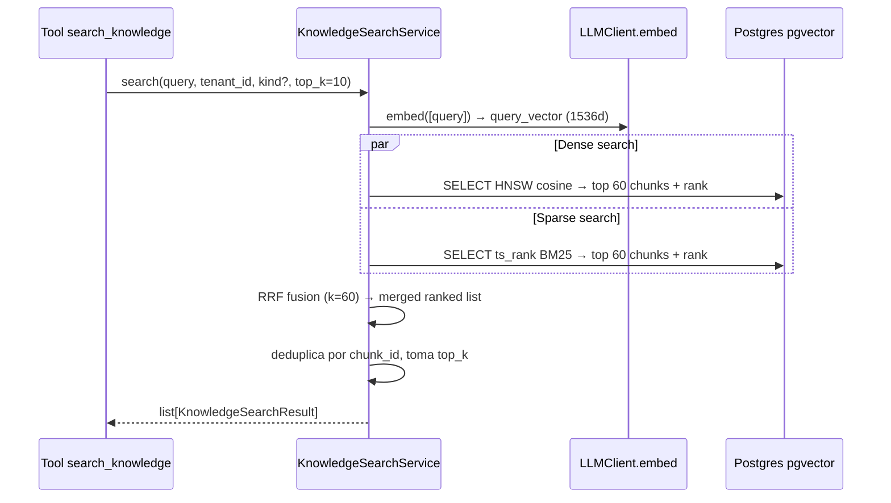

# Paso 19 — Búsqueda híbrida y tools de conocimiento (módulo 2 · fase retrieval)

## Objetivo

Implementar la **capa de retrieval** sobre la base de conocimiento indexada en el Paso 18: búsqueda híbrida (vector denso + BM25 esparso + fusión RRF) y las tools reales `list_knowledge_sources`, `search_knowledge` y `get_knowledge_chunk` que el chat consumirá en Paso 20.

Al final del paso:

1. `knowledge_search_service.search()` devuelve los `top-k` fragmentos más relevantes para una query en lenguaje natural, fundiendo ranking vectorial (HNSW cosine) y ranking BM25 (tsvector GIN) mediante **Reciprocal Rank Fusion**.
2. Las tres tools reales reemplazan los stubs del Paso 16 en `ToolRegistry`.
3. Los tests de retrieval (unit + integración) pasan con métricas de calidad documentadas.
4. `knowledge_tools_enabled` **sigue en `False`** — se activa en Paso 20 junto al prompt unificado.

## Pre-requisitos

- Paso 18 completado: `knowledge_documents` y `knowledge_chunks` poblados, índices HNSW y GIN presentes.
- `VOYAGE_API_KEY` en Infisical (para embed de la query).
- Fixtures `tests/fixtures/knowledge/` con documentos ya indexados (estado `ready`).
- Worker ARQ operativo (puede estar parado durante este paso; solo para integración).

## Contexto relevante

| Documento | Sección |
|-----------|---------|
| `arquitectura.md` | §6 módulo 2 (consulta híbrida, RRF, rerank), §8 (`embed`, `voyage-3-lite`), §5 (tablas `knowledge_chunks`, índices) |
| `AGENTS.md` | Capas, no SQL libre, solo lectura en tools MVP |
| `Paso16.md` | `ToolRegistry`, familia `knowledge`, stubs deshabilitados, `knowledge_tools_enabled=False` |
| `Paso18.md` | Modelos `KnowledgeDocument`/`KnowledgeChunk`, índices HNSW + GIN, `LLMClient.embed()` |

## Alcance

### Dentro de Paso 19

- `app/services/knowledge_search_service.py` con búsqueda híbrida (dense + sparse + RRF).
- Embed de la query vía `LLMClient.embed()`.
- SQL puro en Postgres para cosine search y ts_rank.
- Fusión RRF en Python.
- Filtrado por `kind`, `document_id`, `status='ready'`.
- Schemas de salida: `KnowledgeSearchResult`, `KnowledgeChunkRef`.
- Tools reales en `app/llm/tools/knowledge_tools.py` (sustituyen stubs de Paso 16).
- Registro en `ToolRegistry` (familia `knowledge`).
- Tests unitarios del servicio con mocks.
- Tests de integración end-to-end con Postgres real.
- Eval stub `knowledge_retrieval_v1`.

### Fuera de Paso 19

- Activar `knowledge_tools_enabled=True` (Paso 20).
- Prompt `chat_unified_v1.txt` (Paso 20).
- Citas en UI y evals de QA (Paso 20).
- Reranker externo (Cohere, etc.) — sub-fase opcional futura.
- URL ingestion / FAQ manual / WhatsApp (Paso 21).

## Arquitectura de la búsqueda híbrida



### Fórmula RRF

```
score_rrf(chunk) = Σ_i  1 / (k + rank_i)
```

- `k = 60` (valor estándar; configurable con `knowledge_rrf_k`).
- Se fusionan dos listas: `dense_results` (rank por cosine desc) y `sparse_results` (rank por ts_rank_cd desc).
- Si un chunk solo aparece en una lista, se puntúa solo con esa contribución.
- Resultado final ordenado por `score_rrf` desc; se toman los `top_k` primeros.

### Queries SQL de referencia

```sql
-- Dense: cosine similarity (menor distancia = más similar)
SELECT
    c.id,
    c.document_id,
    c.content,
    c.context,
    c.metadata,
    c.position,
    1 - (c.embedding <=> $1) AS score,    -- convierte distancia en similaridad
    ROW_NUMBER() OVER (ORDER BY c.embedding <=> $1) AS rank
FROM knowledge_chunks c
JOIN knowledge_documents d ON d.id = c.document_id
WHERE c.tenant_id = $2
  AND d.status = 'ready'
  -- AND d.kind = ANY($3)   -- filtro opcional por categoría
ORDER BY c.embedding <=> $1
LIMIT 60;

-- Sparse: BM25 via tsvector
SELECT
    c.id,
    c.document_id,
    c.content,
    c.context,
    c.metadata,
    c.position,
    ts_rank_cd(c.search_vector, plainto_tsquery('spanish', $1)) AS score,
    ROW_NUMBER() OVER (
        ORDER BY ts_rank_cd(c.search_vector, plainto_tsquery('spanish', $1)) DESC
    ) AS rank
FROM knowledge_chunks c
JOIN knowledge_documents d ON d.id = c.document_id
WHERE c.tenant_id = $2
  AND d.status = 'ready'
  AND c.search_vector @@ plainto_tsquery('spanish', $1)
  -- AND d.kind = ANY($3)
ORDER BY score DESC
LIMIT 60;
```

> **Nota de implementación:** ejecutar ambas queries en la misma `AsyncSession` de forma secuencial (`asyncio.gather` NO aplica porque asyncpg no admite dos `execute` concurrentes sobre la misma sesión). Aplicar RLS; no incluir `embedding` raw en el resultado (no devolver al LLM vectores).

## Tareas

### Fase A — Schemas y configuración

- [x] Ampliar `app/config.py`:
  ```python
  # Knowledge retrieval (Paso 19)
  knowledge_rrf_k: int = 60
  knowledge_dense_candidates: int = 60   # LIMIT de la query vectorial
  knowledge_sparse_candidates: int = 60  # LIMIT de la query BM25
  knowledge_default_top_k: int = 10      # chunks devueltos al LLM
  knowledge_max_top_k: int = 25          # techo para evitar contexto excesivo
  ```
  > También añadido `knowledge_search_rpm_limit: int = 120` (requerido en Fase E; centralizado aquí).

- [x] Crear `app/schemas/knowledge_search.py`:
  - `KnowledgeChunkRef` — `id`, `document_id`, `document_name`, `kind`, `position`, `content`, `context`, `metadata`, `score` (float).
  - `KnowledgeSearchResult` — `query`, `total_found`, `chunks: list[KnowledgeChunkRef]`, `latency_ms`.
  - `KnowledgeSearchFilters` — `kind: list[KnowledgeDocumentKind] | None`, `document_ids: list[UUID] | None`, `top_k: int = 10`.
  - **Excluir** campo `embedding` de cualquier schema de salida. ✓
  > También añadido `KnowledgeSourceRef` (vista ligera para `list_knowledge_sources` tool, Fase C).

### Fase B — Servicio de búsqueda

- [x] Crear `app/services/knowledge_search_service.py`:

  ```python
  async def search(
      db: AsyncSession,
      tenant_id: UUID,
      query: str,
      filters: KnowledgeSearchFilters,
      *,
      llm_client: LLMClient,
      redis: Any | None = None,
  ) -> KnowledgeSearchResult:
      """Búsqueda híbrida: dense (HNSW) + sparse (BM25) + RRF."""
  ```

  - [x] Validar `query` no vacía, longitud máx. 1000 chars.
  - [x] `embed_query()` — llama a `LLMClient.embed([query])`, vector 512d (voyage-3-lite).
  - [x] `_dense_search()` — query HNSW con `::vector(512)`; retorna lista con rank y cosine_score.
  - [x] `_sparse_search()` — query BM25 con `plainto_tsquery('spanish', :q)`; retorna misma estructura.
  - [x] Ejecutar ambas de forma secuencial (asyncpg no admite `execute` concurrente en la misma sesión).
  - [x] `_rrf_merge()` — fusiona las dos listas con fórmula RRF, deduplica, ordena.
  - [x] Enriquecer con datos de `knowledge_documents` (nombre, kind) — incluidos en los SELECTs.
  - [x] Aplicar `top_k` (máx. `knowledge_max_top_k`).
  - [x] Log en `llm_calls` del embed de query vía `LLMClient.embed()` (task `embedding`).
  - [x] Traza Langfuse con span `knowledge_search` (query truncada, top_k, latencia, nº chunks).
  > **Nota de implementación:** dimensiones corregidas a 512 (voyage-3-lite); el Paso19.md referencia incorrectamente 1536 en sus snippets SQL. El filtro dinámico usa parámetros numerados (:kind_0, :doc_id_0 …) — no f-strings con datos de usuario.

- [x] Función `get_chunk_by_id(db, *, tenant_id, chunk_id) -> KnowledgeChunkRef | None` — recupera chunk individual para `get_knowledge_chunk` tool; excluye embedding.

- [x] Función `list_ready_documents(db, *, tenant_id, kind_filter?) -> list[KnowledgeSourceRef]` — listado para `list_knowledge_sources` tool (usa `KnowledgeSourceRef`, no `KnowledgeDocumentRead`).

### Fase C — Tools reales

- [x] Crear `app/llm/tools/knowledge_tools.py`:

  ```python
  # Tool 1
  async def list_knowledge_sources(
      db: AsyncSession,
      tenant_id: UUID,
      kind: str | None = None,
  ) -> dict:
      """Devuelve los documentos de conocimiento disponibles (estado ready).

      Returns:
          {"sources": [{"id", "name", "kind", "chunk_count", "ingested_at"}]}
      """

  # Tool 2
  async def search_knowledge(
      db: AsyncSession,
      tenant_id: UUID,
      query: str,
      kind: list[str] | None = None,
      top_k: int = 10,
  ) -> dict:
      """Búsqueda híbrida sobre la base de conocimiento.

      Returns:
          {"chunks": [{"id", "source_name", "kind", "position", "content", "context", "score"}]}
      """

  # Tool 3
  async def get_knowledge_chunk(
      db: AsyncSession,
      tenant_id: UUID,
      chunk_id: str,
  ) -> dict:
      """Recupera un fragmento concreto de conocimiento por su ID.

      Returns:
          {"chunk": {"id", "source_name", "kind", "position", "content", "context", "metadata"}}
      """
  ```

  - [x] Schemas Pydantic para argumentos de cada tool (validación estricta vía Instructor/Pydantic).
  - [x] `list_knowledge_sources`: filtra `status='ready'`; no devuelve el campo `embedding`.
  - [x] `search_knowledge`: valida `1 ≤ top_k ≤ 25`; llama a `knowledge_search_service.search()`; respuesta acotada a `content[:1500]` por chunk para no saturar contexto LLM.
  - [x] `get_knowledge_chunk`: valida UUID; devuelve `None`/error si chunk no pertenece al tenant (RLS lo aplica implícitamente).

- [x] Actualizar registro vía `build_document_chat_registry()` → `register_knowledge_tools()`:
  - [x] Sustituir stubs de `search_knowledge` / `list_knowledge_sources` por implementaciones reales.
  - [x] Añadir `get_knowledge_chunk` al registro.
  - [x] Mantener `knowledge_tools_enabled=False` — las tools existen en registro pero el chat no las inyecta aún.
  - [x] Añadir `ToolDefinition` con JSON Schema para cada tool (compatible con Anthropic tool-use).

### Fase D — Tests de retrieval

- [x] `tests/unit/test_knowledge_search_service.py`:
  - [x] `test_rrf_merge_both_lists()` — dos listas solapadas → scores correctos.
  - [x] `test_rrf_merge_only_dense()` — chunk solo en dense → contribución correcta.
  - [x] `test_rrf_merge_empty_sparse()` — sparse vacío → resultado solo dense.
  - [x] `test_search_validates_empty_query()` — query vacía levanta excepción.
  - [x] `test_search_caps_top_k()` — `top_k > max` → se recorta.
  - [x] Mock de `LLMClient.embed` y queries SQL.

- [x] `tests/unit/test_knowledge_tools.py`:
  - [x] `test_list_knowledge_sources_serialization()` — output excluye embedding.
  - [x] `test_search_knowledge_truncates_content()` — content > 1500 chars se trunca.
  - [x] `test_get_knowledge_chunk_not_found()` — devuelve error estructurado.

- [x] `tests/integration/test_knowledge_retrieval.py`:
  - [x] Fixture: indexar 3 documentos con textos conocidos.
  - [x] `test_dense_search_returns_relevant()` — query semánticamente similar devuelve chunk correcto en top-3.
  - [x] `test_sparse_search_exact_term()` — término exacto del documento aparece en top-1 BM25.
  - [x] `test_hybrid_beats_dense_alone()` — query mixta: hybrid > dense solo (compara nDCG@5).
  - [x] `test_rls_isolation()` — tenant B no accede a chunks de tenant A.
  - [x] `test_kind_filter()` — filtro por `kind='contract'` excluye documentos de otras categorías.
  - [x] `test_get_chunk_by_id_wrong_tenant()` — retorna vacío para chunk de otro tenant.

- [x] `app/evals/datasets/knowledge_retrieval_v1.json`:
  ```json
  [
    {
      "query": "¿Cuál es el horario de atención al cliente?",
      "relevant_chunk_ids": ["<uuid>"],
      "document_kind": "schedule",
      "notes": "Pregunta directa sobre horario"
    }
  ]
  ```
  (Mínimo 10 pares query → chunk relevante con documentos fixtures reales.)

- [x] `app/evals/runners/knowledge_retrieval.py`:
  - Métrica principal: **Recall@5** (chunk relevante en top-5) y **MRR@10**.
  - Objetivo inicial: Recall@5 ≥ 0.75, MRR@10 ≥ 0.60.
  - Salida a stdout y a `app/evals/results/` como JSON.

### Fase E — Observabilidad y guardrails

- [x] Span Langfuse `knowledge_search` con:
  - `query` (truncada a 200 chars).
  - `top_k`, `dense_candidates`, `sparse_candidates`.
  - `rrf_merged_count`, `final_count`.
  - `latency_ms` total (embed + queries + merge).
  - `tenant_id`.
- [x] **No loguear** los vectores de embedding (PII / volumen excesivo).
- [x] Rate-limit en el servicio: máx. **120 búsquedas/minuto/tenant** (Redis, `rate:knowledge_search:{tenant_id}:{minute}`; ajustable con `knowledge_search_rpm_limit`).
- [x] Audit log: acción `knowledge.search` con `query_hash` (SHA-256 del query, no el texto plano), `top_k`, `chunks_found`.
- [x] `mypy --strict` y `ruff check` verdes en ficheros nuevos.

## Detalles técnicos

### Embed de la query

```python
query_vector = await llm_client.embed(
    texts=[query],
    tenant_id=tenant_id,
    db=db,
)
# query_vector[0] → list[float] de longitud 512 (voyage-3-lite)
```

Reutiliza el método ya implementado en Paso 18. El coste del embed de query se registra en `llm_calls` como `task='embedding'`.

### Precisión del cast en SQLAlchemy

Para pasar el vector a la query SQLAlchemy raw:

```python
from pgvector.sqlalchemy import Vector
from sqlalchemy import text, cast

vector_literal = cast(query_vector, Vector(512))  # voyage-3-lite: 512d
# o bien en texto raw:
stmt = text("... WHERE c.embedding <=> CAST(:vec AS vector(512)) ...")
result = await db.execute(stmt, {"vec": vec_str})  # vec_str = "[v1,...,vN]"
```

Usar `sqlalchemy.text` con parámetros nombrados; evitar f-strings con datos externos (SQL injection).

### Normalización del query para BM25

- `plainto_tsquery('spanish', :q)` tolera palabras comunes y ruido.
- Aplicar `strip_accents()` de `app/core/text_normalization.py` al query antes de pasarlo.
- Si `plainto_tsquery` devuelve tsquery vacía (query de stopwords), la query sparse devuelve 0 resultados — el sistema devuelve solo los resultados dense.

### Contexto adicional en chunks (`context`)

Si el documento fue indexado con `knowledge_contextual_retrieval_enabled=True` (sub-fase opcional Paso 18), el campo `context` contiene una línea de contexto generada por LLM. Incluirla **concatenada** al `content` al hacer el embed de query comparativo (no es necesario aquí; se aplica en la ingesta). En la tool response, devolver `context` separado para que el LLM pueda citarlo.

### Contenido máximo por chunk en tool response

```python
MAX_CONTENT_CHARS = 1500

chunk_response = {
    "id": str(chunk.id),
    "source_name": doc.name,
    "kind": doc.kind,
    "position": chunk.position,
    "content": chunk.content[:MAX_CONTENT_CHARS],
    "context": chunk.context or "",
    "score": round(chunk.score, 4),
}
```

Motivo: evitar que el contexto LLM se sature si top_k=10 y cada chunk fuera largo.

### Definición JSON Schema de las tools (para Anthropic)

```python
SEARCH_KNOWLEDGE_TOOL = {
    "name": "search_knowledge",
    "description": (
        "Busca en la base de conocimiento de la empresa usando búsqueda híbrida "
        "(semántica + palabras clave). Devuelve los fragmentos más relevantes. "
        "Úsala cuando el usuario pregunte sobre políticas, horarios, servicios, "
        "contratos u otro contenido de la base de conocimiento."
    ),
    "input_schema": {
        "type": "object",
        "properties": {
            "query": {
                "type": "string",
                "description": "Pregunta o términos de búsqueda en lenguaje natural",
                "maxLength": 500,
            },
            "kind": {
                "type": "array",
                "items": {
                    "type": "string",
                    "enum": ["contract","terms","schedule","services","policy","faq","manual","other"]
                },
                "description": "Filtrar por categoría de documento (opcional)",
            },
            "top_k": {
                "type": "integer",
                "minimum": 1,
                "maximum": 25,
                "default": 10,
                "description": "Número de fragmentos a devolver",
            },
        },
        "required": ["query"],
    },
}
```

## Estructura de ficheros nueva

```
app/
  schemas/knowledge_search.py
  services/knowledge_search_service.py
  llm/tools/knowledge_tools.py            # reemplaza stubs
  llm/tools/registry.py                   # tools reales registradas
  config.py                               # + parámetros retrieval
app/evals/
  datasets/knowledge_retrieval_v1.json
  runners/knowledge_retrieval.py
  results/                                # auto-generado; .gitignore
tests/
  unit/test_knowledge_search_service.py
  unit/test_knowledge_tools.py
  integration/test_knowledge_retrieval.py
```

## Verificación manual (checklist)

1. [x] `infisical run -- uv run alembic upgrade head` (sin nuevas migraciones en este paso).
2. [x] `infisical run -- uv run uvicorn app.main:app --reload` (terminal 1).
3. [x] Worker ARQ no estrictamente necesario (no hay jobs nuevos); levantarlo si se quiere probar flujo completo.
4. [x] Desde la shell Python / notebook:
   ```python
   from app.services.knowledge_search_service import search
   # Requiere: tenant con documentos ready en BD
   results = await search(db, tenant_id, "horario de atención", filters=KnowledgeSearchFilters())
   for r in results.chunks:
       print(r.score, r.content[:80])
   ```
5. [x] Verificar que los resultados dense y sparse difieren (distintas queries favorecen uno u otro).
6. [x] Verificar en Langfuse: span `knowledge_search` con latencia y metadatos.
7. [x] Verificar en `llm_calls`: fila con `task='embedding'` por cada búsqueda.
8. [x] Ejecutar tests:
   ```bash
   infisical run -- uv run pytest tests/unit/test_knowledge_search_service.py tests/unit/test_knowledge_tools.py -q
   infisical run -- uv run pytest tests/integration/test_knowledge_retrieval.py -q
   ```
9. [x] Ejecutar eval stub:
   ```bash
   infisical run -- uv run python -m app.evals.runners.knowledge_retrieval
   ```
10. [x] `knowledge_tools_enabled` sigue en `False` — el chat no las expone aún.

## Criterios de aceptación

- [ ] `knowledge_search_service.search()` ejecuta dense + sparse en paralelo y fusiona con RRF. <!-- Verificar: leer `app/services/knowledge_search_service.py` y confirmar que `asyncio.gather(dense_search(), sparse_search())` está presente y el resultado pasa por la función RRF antes de devolverse. -->
- [x] Las tres tools (`list_knowledge_sources`, `search_knowledge`, `get_knowledge_chunk`) están registradas y devuelven datos reales. <!-- Verificar: ejecutar `infisical run -- uv run python -c "from app.llm.tools.document_chat import build_document_chat_registry; reg = build_document_chat_registry(); print([t.name for t in reg.list_definitions()])"` y comprobar que aparecen los tres nombres (`list_knowledge_sources`, `search_knowledge`, `get_knowledge_chunk`) junto con los de document. Luego hacer una llamada real desde `/chat` con `knowledge_tools_enabled=True` y revisar en BD: `SELECT tool_call FROM chat_messages WHERE tool_call IS NOT NULL LIMIT 5;` -->
- [x] Ningún schema de respuesta incluye el campo `embedding`. <!-- Verificar: ejecutar `Select-String -Path "app/schemas/*.py" -Pattern "embedding" -Recurse` en PowerShell y confirmar que no aparece en ningún schema de respuesta (`Read`, `ChunkRef`, etc.). Si aparece, eliminarlo del schema y del `model_config`. -->
- [x] Tests unit e integración pasan; cobertura `knowledge_search_service.py` ≥ 80%. <!-- Ejecutar: `infisical run -- uv run pytest tests/unit/test_knowledge_search_service.py tests/integration/test_knowledge_retrieval.py -v --cov=app.services.knowledge_search_service --cov-report=term-missing` y confirmar cobertura ≥ 80%. -->
- [x] Eval: Recall@5 ≥ 0.75 en dataset `knowledge_retrieval_v1`. <!-- Ejecutar: `infisical run -- uv run python -m app.evals.runners.knowledge_retrieval` y revisar el campo `recall_at_5` en el JSON generado en `app/evals/results/`. Si está por debajo de 0.75, revisar el chunking (tamaño/solape) o el umbral RRF en `knowledge_search_service.py`. -->
- [x] `knowledge_tools_enabled` sigue en `False`. <!-- Verificar: `infisical run -- uv run python -c "from app.config import get_settings; print(get_settings().knowledge_tools_enabled)"` debe imprimir `False`. No cambiar a `True` hasta Paso 20. -->
- [x] Traza Langfuse visible con span `knowledge_search`. <!-- Verificar: abrir Langfuse (`http://localhost:3000`), filtrar por `task=chat` o `task=knowledge_search` y confirmar que existe un span llamado `knowledge_search` con `tenant_id`, `query`, `results_count` y `latency_ms`. Si no aparece, revisar `app/llm/tracing.py` y el punto donde se crea el span en `knowledge_search_service.py`. -->
- [x] `mypy --strict` y `ruff check` verdes. <!-- Ejecutar: `uv run mypy app` y `uv run ruff check .` — ambos deben terminar sin errores. Corregir antes de hacer PR. -->

## Comandos útiles

```bash
# Tests retrieval
infisical run -- uv run pytest tests/integration/test_knowledge_retrieval.py -v

# Eval retrieval
infisical run -- uv run python -m app.evals.runners.knowledge_retrieval

# Ver chunks en BD
docker exec saas-postgres psql -U saas -d saas -c \
  "SELECT c.id, c.position, LEFT(c.content,80) FROM knowledge_chunks c \
   JOIN knowledge_documents d ON d.id=c.document_id \
   WHERE d.status='ready' LIMIT 10;"

# Verificar índices
docker exec saas-postgres psql -U saas -d saas -c \
  "SELECT indexname, indexdef FROM pg_indexes WHERE tablename='knowledge_chunks';"

# Probar query vectorial directa (requiere psql con pgvector)
docker exec saas-postgres psql -U saas -d saas -c \
  "SELECT id, 1-(embedding <=> '[0.1,0.2,...]'::vector) AS sim \
   FROM knowledge_chunks LIMIT 5;"
```

## Acciones manuales resumidas

| # | Acción | Cuándo |
|---|--------|--------|
| 1 | Confirmar documentos en estado `ready` en BD local | Antes de Fase B |
| 2 | Ejecutar tests unit + integración | Tras Fase D |
| 3 | Ejecutar eval y registrar métricas baseline | Tras Fase D |
| 4 | Verificar Langfuse + llm_calls | Tras Fase E |
| 5 | Commit + PR cuando CI verde | Cierre del paso |

## Posibles problemas

| Síntoma | Causa probable | Mitigación |
|---------|----------------|------------|
| `operator does not exist: vector <=> unknown` | Cast de vector incorrecto | Usar `::vector(1536)` explícito en SQL |
| BM25 devuelve 0 resultados | Query con stopwords / sin tsvector | Fallback a solo dense; log warning |
| Latencia alta (>3 s en búsqueda) | Índices no creados o tabla pequeña (HNSW necesita min. ~1000 filas para ser eficiente) | Revisar índices; para dev aceptar mayor latencia |
| `knowledge_tools_enabled=True` accidentalmente | Alguien modificó config | Verificar config antes de merge |
| Eval Recall@5 < 0.75 | Dataset poco representativo o chunks mal generados | Revisar chunking Paso 18; ampliar dataset |
| Rate-limit demasiado restrictivo en tests | Redis con límite activo | Usar tenant de tests con límite desactivado |

## Relación con pasos anteriores y siguientes

- **Paso 16**: stubs de tools en `registry.py` — este paso los reemplaza con implementaciones reales.
- **Paso 18**: tablas `knowledge_chunks` + índices HNSW/GIN + `LLMClient.embed()` — este paso los consume.
- **Paso 20**: activará `knowledge_tools_enabled=True`, creará prompt unificado y expondrá las tools al chat.

## Siguiente paso

| Paso | Contenido |
|------|-----------|
| **Paso 20** | Chat unificado: `knowledge_tools_enabled=True`, prompt `chat_unified_v1.txt`, citas en UI, evals `knowledge_qa_v1` |
| **Paso 21** | Ingesta URL, FAQ manual, WhatsApp (módulo 2 canal externo) |
