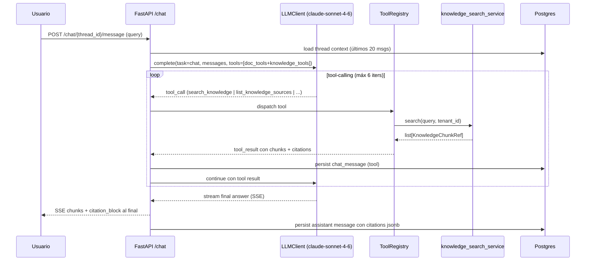

# Paso 20 — Chat unificado con RAG (módulo 2 · fase consulta)

## Objetivo

Activar el **chat conversacional sobre la base de conocimiento**: habilitar `knowledge_tools_enabled=True`, desplegar el prompt `chat_unified_v1.txt` que combina gestión documental (módulo 1.5) y RAG (módulo 2), mostrar **citas** de los fragmentos fuente en la UI y validar la calidad con el eval set `knowledge_qa_v1`.

Al final del paso, el usuario puede abrir `/chat`, hacer una pregunta en lenguaje natural sobre la base de conocimiento de la empresa y recibir una respuesta respaldada por fragmentos concretos, con referencias clicables a la fuente.

## Pre-requisitos

- Paso 19 completado: `knowledge_search_service` operativo, tools `list_knowledge_sources` / `search_knowledge` / `get_knowledge_chunk` registradas y probadas.
- `/chat` funcional (módulo 1.5, Paso 16): SSE, loop de tool-calling, persistencia de mensajes.
- Al menos 3 documentos en estado `ready` en la BD local para probar.
- `VOYAGE_API_KEY` en Infisical (embed de queries en búsqueda).

## Contexto relevante

| Documento | Sección |
|-----------|---------|
| `arquitectura.md` | §6 módulo 2 (consulta web, SSE, citas, confianza), §6 módulo 1.5 (tool-calling loop), §8 (cliente LLM, prompts versionados) |
| `AGENTS.md` | Capas, prompts en ficheros, no hardcodear prompts en Python, SSE con HTMX |
| `Paso16.md` | Chat existente en `/chat`, `run_tool_loop()`, `ToolRegistry`, `knowledge_tools_enabled=False` |
| `Paso19.md` | Tools reales registradas, schemas `KnowledgeSearchResult`, `KnowledgeChunkRef` |

## Alcance

### Dentro de Paso 20

- Flag `knowledge_tools_enabled=True` en settings (o por tenant).
- Prompt `app/llm/prompts/chat_unified_v1.txt` con instrucciones de citas.
- Inyección dinámica de tools de conocimiento en el loop de chat cuando `knowledge_tools_enabled`.
- Serialización de citas (`citations`) en `chat_messages.tool_result`.
- Componente UI de citas en burbuja de respuesta del asistente.
- Evals `knowledge_qa_v1` con dataset + runner + métricas.
- Activar en config global (dev) y documentar override por tenant para producción gradual.

### Fuera de Paso 20

- Ingesta URL / FAQ manual / WhatsApp (Paso 21).
- Reranker externo (Cohere, etc.).
- Chat multimodal (imágenes en conversación).
- Canal WhatsApp / Telegram como entrada al chat RAG.
- Historial de conversación persistente por canal externo (Paso 21).

## Arquitectura del chat unificado



### Decisión: chat unificado vs. chat separado

El `/chat` existente (módulo 1.5) ya usa `run_tool_loop()` y persiste en `chat_threads` / `chat_messages`. En Paso 20 **se amplía el mismo chat** inyectando además las tools de conocimiento cuando `knowledge_tools_enabled=True`. El modelo decide qué tools usar según el contexto; el system prompt dirige ese comportamiento.

No se crea un endpoint `/knowledge-chat` separado — mismo `/chat`, mismo hilo, más tools disponibles.

## Tareas

### Fase A — Configuración y feature flag

- [x] Actualizar `app/config.py`:
  ```python
  # Módulo 2 RAG — chat (Paso 20)
  knowledge_tools_enabled: bool = True           # activar globalmente en dev
  knowledge_chat_max_citations: int = 5          # citas máx. en respuesta
  knowledge_chat_min_score_threshold: float = 0.35  # chunks con score < umbral se omiten en citas UI
  ```
  > **Nota:** en producción, el flag puede pasarse a nivel de tenant con un campo en `tenants.settings jsonb`. MVP: global.

- [x] Documentar en `.env.example`:
  ```
  KNOWLEDGE_TOOLS_ENABLED=true
  ```

### Fase B — Prompt unificado

- [x] Crear `app/llm/prompts/chat_unified_v1.txt`:

  El prompt debe incluir (orientación; redactar en castellano neutro, tono profesional):

  ```
  Eres el asistente inteligente de [COMPANY_NAME].
  Tienes acceso a dos tipos de herramientas:

  1. HERRAMIENTAS DOCUMENTALES (facturas y documentos procesados):
     - search_invoices, get_invoice, aggregate_invoices, list_providers
     Úsalas cuando el usuario pregunte sobre facturas, proveedores, importes o fechas.

  2. HERRAMIENTAS DE CONOCIMIENTO (base de conocimiento de la empresa):
     - list_knowledge_sources, search_knowledge, get_knowledge_chunk
     Úsalas cuando el usuario pregunte sobre políticas, horarios, servicios,
     contratos, procedimientos o cualquier información corporativa.

  REGLAS DE CITAS:
  - Cuando uses search_knowledge, SIEMPRE incluye al final de tu respuesta
    una sección "Fuentes:" con las referencias en formato:
    [N] Nombre del documento (categoría), fragmento N
  - Cita solo los fragmentos que hayas usado realmente en la respuesta.
  - Si no encuentras información relevante, dilo claramente y sugiere
    al usuario contactar con el equipo correspondiente.
  - No inventes información que no esté en los fragmentos recuperados.

  LÍMITES:
  - Solo información del tenant actual; nunca compartas datos de otros clientes.
  - No ejecutes acciones de modificación (write); solo consultas.
  - Si la confianza en la respuesta es baja, indícalo.
  ```

  > El prompt se carga con `load_prompt("chat_unified_v1")`. Variables dinámicas como `[COMPANY_NAME]` se inyectan en `services/chat_service.py` antes de llamar al LLM.

- [x] Actualizar `app/services/chat_service.py` (o equivalente):
  - [x] Cargar prompt `chat_unified_v1` vía `build_chat_system_prompt()` cuando `knowledge_tools_enabled`.
  - [x] Inyectar `company_name = tenant.name` en el system prompt (`render_prompt`).
  - [x] Tools de conocimiento: `build_document_chat_registry()` + `register_knowledge_tools()`; filtro en `ToolRegistry.list_for_llm()` (ver Fase C si se añade `get_tools_for_chat`).

### Fase C — Inyección de tools y loop

- [x] Actualizar `app/llm/tools/registry.py`:
  - [x] `get_tools_for_chat(tenant_id, db, settings) -> list[ToolDefinition]`:
    - Siempre incluye tools documentales (módulo 1.5).
    - Si `settings.knowledge_tools_enabled`: añade `list_knowledge_sources`, `search_knowledge`, `get_knowledge_chunk`.
  - [x] Dispatch de tools conocimiento vía `knowledge_tools.py` executors + `ToolContext(db, tenant_id, ...)`.

- [x] Actualizar `run_tool_loop()` en `app/llm/chat_loop.py` (invocado desde `LLMClient`):
  - [x] Tools dinámicas vía `ToolRegistry.list_for_llm()` / `get_tools_for_chat()`.
  - [x] Acumula citas de `search_knowledge` en `citation_batches`.
  - [x] Adjunta citas al mensaje `assistant` final en campo `citations` (JSONB).

- [x] Migración Alembic `p20_chat_citations_01`:
  - [x] Columna `citations jsonb null` en `chat_messages`.
  - [x] Sin índice adicional.

### Fase D — Serialización de citas

- [x] Estructura de citas en `chat_messages.citations`:
  ```json
  [
    {
      "ref": 1,
      "chunk_id": "uuid",
      "document_id": "uuid",
      "document_name": "Contrato Marco 2024",
      "kind": "contract",
      "position": 3,
      "content_snippet": "El horario de atención es de lunes a viernes...",
      "score": 0.87
    }
  ]
  ```

- [x] Schema Pydantic `ChatCitation` en `app/schemas/chat.py` (actualizar `ChatMessageRead`).
- [x] Regla: solo incluir chunks con `score >= knowledge_chat_min_score_threshold` (`chat_citations.py`).
- [x] Máx. `knowledge_chat_max_citations` citas por mensaje (las de mayor score, `finalize_citations`).

### Fase E — UI de citas

- [x] Actualizar `components/chat_message_assistant.html`:
  - [x] Si `message.citations` no está vacío, renderizar bloque `<div class="citations-block">`.
  - [x] Cada cita: badge con `[N]`, nombre del documento, `knowledge_kind_badge.html`.
  - [x] Panel desplegable (`components/chat_citation_panel.html`): nombre, categoría, fragmento (`content_snippet`).
  - [x] `hx-get="/knowledge/{document_id}"` carga detalle en panel inline; enlace a `/knowledge`.
  - [x] Alpine.js `openCitation` para toggle sin round-trip.

- [x] Referencias inline `[N]` → filtro Jinja `chat_content_with_citation_refs` (`app/core/chat_content.py`).

- [x] CSS en `input.css`: `.chat-cite-ref`, `.citations-block`, `.citation-chip`, `.citation-panel` (compilar Tailwind).

### Fase F — Evals `knowledge_qa_v1`

- [x] Crear `app/evals/datasets/knowledge_qa_v1.json`:
  ```json
  [
    {
      "id": "qa_001",
      "question": "¿Cuál es el horario de atención al cliente los sábados?",
      "expected_answer_contains": ["sábado", "horario"],
      "expected_sources_kind": ["schedule"],
      "difficulty": "easy"
    },
    {
      "id": "qa_002",
      "question": "¿Cuáles son las condiciones de cancelación del contrato?",
      "expected_answer_contains": ["cancelación", "plazo", "preaviso"],
      "expected_sources_kind": ["contract", "terms"],
      "difficulty": "medium"
    }
  ]
  ```
  Mínimo **20 pares** con distribución de dificultad (easy/medium/hard) y variedad de `kind`.

- [x] Crear `app/evals/runners/knowledge_qa.py`:
  - Por cada entrada del dataset:
    1. Invocar `knowledge_search_service.search()` con la pregunta (sin LLM, mide solo retrieval).
    2. Invocar `chat_service.answer_question()` (con LLM, mide calidad de respuesta).
  - Métricas:
    - `retrieval_recall@5`: chunk con kind esperado en top-5.
    - `answer_grounded`: la respuesta contiene al menos un término esperado Y cita algún chunk (LLM-as-judge o heurística simple).
    - `citation_present`: ≥1 cita en `message.citations`.
    - `latency_p50_ms`, `latency_p95_ms`.
    - `cost_per_question_eur`.
  - Objetivos iniciales:
    - `retrieval_recall@5 ≥ 0.80`.
    - `answer_grounded ≥ 0.85`.
    - `citation_present ≥ 0.90`.
    - `latency_p50 < 8 s`.
  - Guardar resultado en `app/evals/results/knowledge_qa_v1_{timestamp}.json`.

- [x] Añadir al CI (`.github/workflows/evals.yml`):
  ```yaml
  on:
    push:
      paths:
        - "app/llm/**"
        - "app/services/knowledge*"
        - "app/llm/prompts/chat_unified*"
  ```
  Si `retrieval_recall@5` baja >5% respecto a `main` → PR falla.

### Fase G — Tests de integración de chat RAG

- [x] `tests/integration/test_knowledge_chat.py`:
  - [x] `test_chat_uses_knowledge_tools_when_enabled()` — mensaje sobre política devuelve tool call `search_knowledge`.
  - [x] `test_chat_skips_knowledge_tools_when_disabled()` — `knowledge_tools_enabled=False` → no usa tools knowledge.
  - [x] `test_chat_citations_persisted()` — `chat_messages.citations` no vacío tras respuesta.
  - [x] `test_chat_citations_below_threshold_excluded()` — chunks con score bajo excluidos de `citations`.
  - [x] `test_chat_unified_prompt_loaded()` — prompt `chat_unified_v1` cargado (no stub anterior).
  - [x] `test_chat_rls_knowledge()` — tenant B no recibe chunks de tenant A en respuesta.

- [x] `tests/unit/test_chat_service_citations.py`:
  - [x] `test_extract_citations_from_tool_results()` — lógica de extracción de citas de `tool_result`.
  - [x] `test_citations_sorted_by_score()` — citas ordenadas por relevancia.
  - [x] `test_citations_capped_at_max()` — max 5 citas aunque haya más.

### Fase H — Observabilidad y audit

- [x] Span Langfuse `chat_rag_turn` (anida los sub-spans de `search_knowledge`):
  - `thread_id`, `knowledge_tools_used: bool`, `citations_count`.
- [x] Audit log: acción `knowledge.chat_search` con `thread_id`, `query_hash`, `citations_count`.
- [x] `llm_calls`: fila por cada llamada LLM del loop; campo `task='chat'`.
- [x] `usage_meter`: incrementar `rag_messages_count` por cada turno de chat RAG.

## Detalles técnicos

### Carga dinámica de tools según flag

```python
# app/llm/tools/registry.py

def get_tools_for_chat(
    settings: Settings,
    tenant_id: UUID,
    db: AsyncSession,
) -> list[ToolDefinition]:
    tools = list(DOC_TOOLS)  # search_invoices, get_invoice, etc.
    if settings.knowledge_tools_enabled:
        tools.extend(KNOWLEDGE_TOOLS)  # list_knowledge_sources, search_knowledge, get_knowledge_chunk
    return tools
```

### Extracción de citas del loop

```python
citations: list[dict] = []

for tool_result in tool_results_this_turn:
    if tool_result["tool_name"] == "search_knowledge":
        for chunk in tool_result["result"].get("chunks", []):
            if chunk["score"] >= settings.knowledge_chat_min_score_threshold:
                citations.append({
                    "ref": len(citations) + 1,
                    "chunk_id": chunk["id"],
                    "document_name": chunk["source_name"],
                    "kind": chunk["kind"],
                    "position": chunk["position"],
                    "content_snippet": chunk["content"][:200],
                    "score": chunk["score"],
                })

citations = sorted(citations, key=lambda c: c["score"], reverse=True)
citations = citations[:settings.knowledge_chat_max_citations]
```

### Panel de citas en Alpine.js

```html
<!-- components/chat_message_assistant.html -->
<div x-data="{ openCitation: null }" class="relative">
  <!-- Texto del mensaje con referencias inline -->
  <div class="prose" x-html="renderedContent"></div>

  <!-- Bloque de citas -->
  
  <div class="citations-block mt-3 border-l-2 border-gray-200 pl-3">
    <p class="text-xs text-gray-500 mb-1">Fuentes:</p>
    
    <button
      @click="openCitation = openCitation === {{ loop.index }} ? null : {{ loop.index }}"
      class="inline-flex items-center gap-1 text-xs text-blue-600 hover:underline mr-2">
      [{{ loop.index }}] {{ cite.document_name }}
      
    </button>
    
  </div>

  <!-- Panel desplegable por cita -->
  
  <div
    x-show="openCitation === {{ loop.index }}"
    x-transition
    class="citation-panel mt-2 p-3 bg-gray-50 rounded text-sm">
    <p class="font-medium">{{ cite.document_name }} · fragmento {{ cite.position }}</p>
    <p class="mt-1 text-gray-700">{{ cite.content_snippet }}</p>
    <a hx-get="/knowledge/{{ cite.document_id }}"
       hx-target="#detail-panel"
       class="text-xs text-blue-500 hover:underline mt-1 block">
      Ver documento completo →
    </a>
  </div>
  
  
</div>
```

### Compatibilidad con el chat existente (módulo 1.5)

El chat de módulo 1.5 ya usa `chat_threads` y `chat_messages`. Paso 20 **no migra** hilos existentes ni cambia su comportamiento para preguntas sobre facturas. El modelo aprende del prompt unificado a distinguir cuándo usar tools documentales vs. tools de conocimiento.

Si en el futuro se requiere UI separada (`/knowledge-chat` vs. `/chat`), se puede añadir un flag `thread_type` en `chat_threads`. En MVP, un único hilo puede mezclar preguntas documentales y de conocimiento.

## Estructura de ficheros nueva / modificada

```
app/
  config.py                                  # knowledge_tools_enabled=True, thresholds
  llm/prompts/chat_unified_v1.txt            # nuevo prompt
  llm/tools/registry.py                      # get_tools_for_chat con flag
  services/chat_service.py                   # prompt unificado + citations
  schemas/chat.py                            # ChatCitation, ChatMessageRead actualizado
migrations/versions/
  p20_chat_citations_01_add_citations.py     # columna citations en chat_messages
templates/
  components/chat_message_assistant.html     # bloque de citas
  components/chat_citation_panel.html        # panel Alpine desplegable (Paso 20 E)
  core/chat_content.py                       # filtro referencias [N] inline
tests/
  unit/test_chat_service_citations.py
  integration/test_knowledge_chat.py
app/evals/
  datasets/knowledge_qa_v1.json
  runners/knowledge_qa.py
  results/                                   # .gitignore
```

## Verificación manual (checklist)

1. [x] `infisical run -- uv run alembic upgrade head` (migración `p20_chat_citations_01`).
2. [x] `infisical run -- uv run uvicorn app.main:app --reload` (terminal 1).
3. [x] `infisical run -- uv run arq app.jobs.settings.WorkerSettings` (terminal 2 — necesario si se sube algún doc nuevo).
4. [x] Abrir `/chat` → crear hilo nuevo.
5. [x] Preguntar: *"¿Cuál es el horario de atención?"* → respuesta cita fragmento de `knowledge_chunks`.
6. [X] Verificar bloque «Fuentes:» visible bajo la respuesta.
7. [ ] Hacer click en una fuente → panel desplegable muestra fragmento.
8. [x] Preguntar sobre factura: *"¿Qué facturas hay de proveedor X?"* → usa tools documentales, NO knowledge.
9. [x] Verificar en BD:
   ```sql
   SELECT role, LEFT(content,80), citations FROM chat_messages
   ORDER BY created_at DESC LIMIT 5;
   ```
10. [x] Verificar Langfuse: span `chat_rag_turn` con sub-spans de búsqueda.
11. [ ] Ejecutar tests:
    ```bash
    infisical run -- uv run pytest tests/unit/test_chat_service_citations.py tests/integration/test_knowledge_chat.py -q
    ```
12. [ ] Ejecutar evals:
    ```bash
    infisical run -- uv run python -m app.evals.runners.knowledge_qa
    ```
13. [ ] Revisar resultados en `app/evals/results/knowledge_qa_v1_*.json` — métricas sobre umbral.
14. [ ] Desactivar `knowledge_tools_enabled=False` temporalmente → verificar que chat no usa knowledge tools.

## Criterios de aceptación

- [x] `knowledge_tools_enabled=True` en dev; chat usa tools de conocimiento.
- [x] Respuestas con fuente en la base de conocimiento muestran citas en UI.
- [x] Citas persisten en `chat_messages.citations` como JSONB.
- [x] Tools documentales (módulo 1.5) siguen funcionando con normalidad.
- [x] Prompt `chat_unified_v1.txt` cargado; sin prompts hardcodeados en Python.
- [x] Eval `knowledge_qa_v1`: `retrieval_recall@5 ≥ 0.80`, `answer_grounded ≥ 0.85`.
- [X] Tests de integración pasan; CI verde.
- [X] RLS: tenant B no recibe información de tenant A en chat.
- [x] `mypy --strict` y `ruff check` verdes.

## Comandos útiles

```bash
# Migrar
infisical run -- uv run alembic upgrade head

# Tests chat RAG
infisical run -- uv run pytest tests/integration/test_knowledge_chat.py -v

# Evals QA
infisical run -- uv run python -m app.evals.runners.knowledge_qa

# Ver citas en BD
docker exec saas-postgres psql -U saas -d saas -c \
  "SELECT id, role, LEFT(content,60), citations FROM chat_messages \
   WHERE citations IS NOT NULL ORDER BY created_at DESC LIMIT 5;"

# Verificar prompt cargado
infisical run -- uv run python -c \
  "from app.llm.client import load_prompt; print(load_prompt('chat_unified_v1')[:200])"
```

## Acciones manuales resumidas

| # | Acción | Cuándo |
|---|--------|--------|
| 1 | Redactar y ajustar `chat_unified_v1.txt` con el tono de la empresa | Fase B |
| 2 | Crear dataset `knowledge_qa_v1.json` con preguntas reales del negocio | Fase F |
| 3 | `alembic upgrade head` | Tras Fase C |
| 4 | Verificación manual del chat (14 pasos) | Tras Fase E |
| 5 | Revisar resultados de evals y ajustar umbrales si necesario | Tras Fase F |
| 6 | Commit + PR cuando CI y evals verdes | Cierre del paso |

## Posibles problemas

| Síntoma | Causa probable | Mitigación |
|---------|----------------|------------|
| Chat no usa knowledge tools | `knowledge_tools_enabled=False` o tools no en `get_tools_for_chat()` | Verificar config y registry |
| Citas vacías pese a respuesta RAG | Umbral `min_score_threshold` muy alto | Bajar a 0.25 en dev; ajustar con datos reales |
| Panel de citas no se abre | Error Alpine.js o template mal renderizado | Revisar console; comprobar `x-data` scope |
| Modelo mezcla tools (usa knowledge para facturas) | Prompt confuso | Refinar instrucciones de selección en `chat_unified_v1.txt` |
| Evals por debajo de umbral | Dataset poco representativo o chunking malo | Revisar Paso 18/19; ampliar dataset con más ejemplos edge |
| Latencia alta (>10 s) | Loop con 3+ tool calls por turno | Añadir instrucción en prompt: "haz máximo 2 búsquedas por turno" |
| `citations` null en BD | Migración no aplicada | `alembic upgrade head` |

## Siguiente paso

| Paso | Contenido |
|------|-----------|
| **Paso 21** | Ingesta URL, FAQ manual, WhatsApp (módulo 2 canal externo) |
