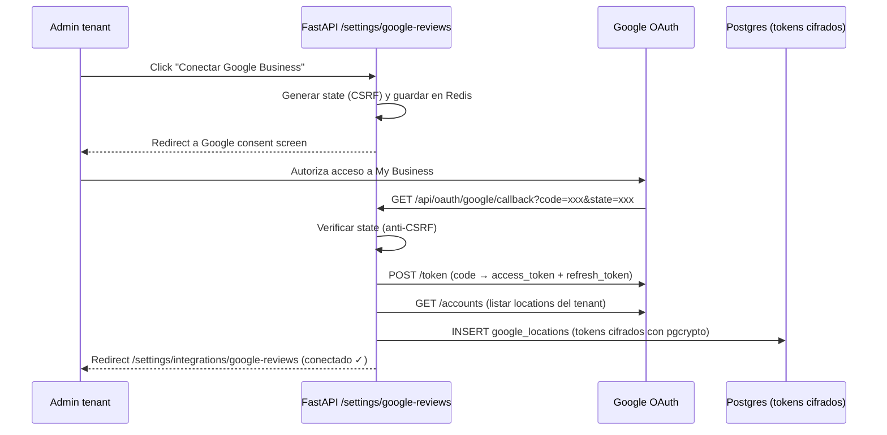
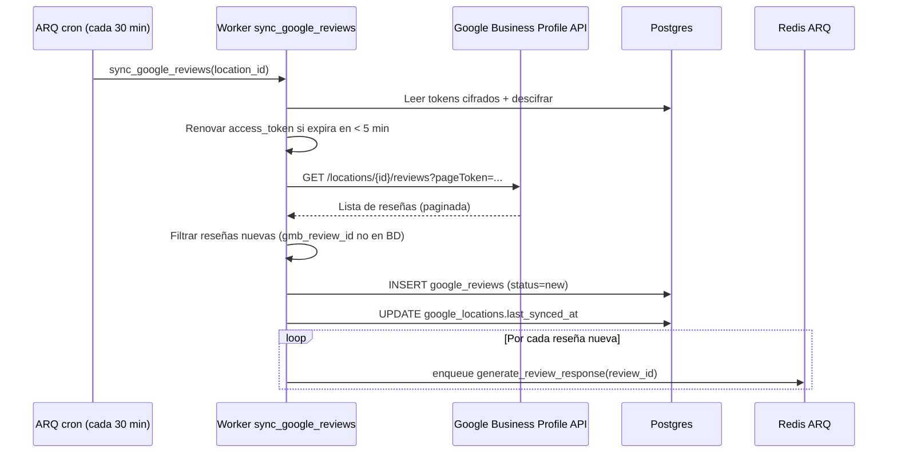
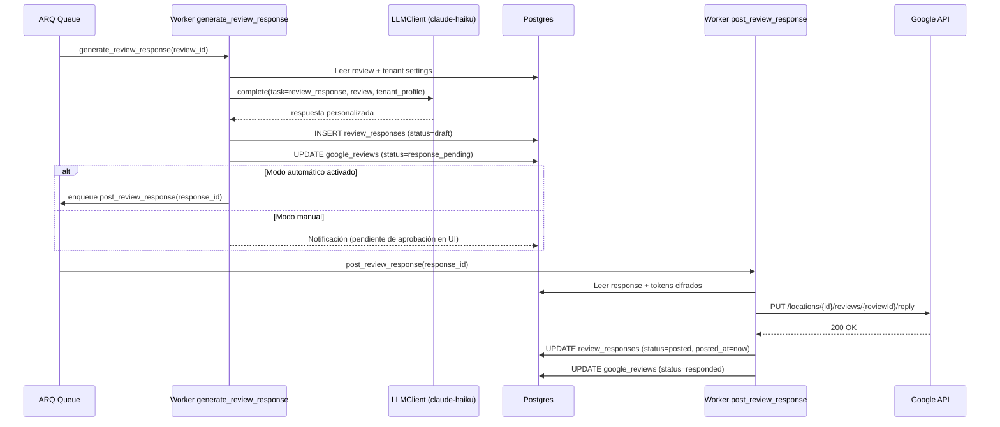

# Paso 22 — Módulo 4: Seguimiento de reseñas Google y respuestas automáticas personalizadas

## Objetivo

Implementar el **Módulo 4 — Reputación**: conectar la cuenta de Google Business Profile de cada pyme (OAuth 2.0 por tenant), sincronizar sus reseñas periódicamente, generar respuestas personalizadas con LLM y publicarlas en Google de forma automática o con aprobación manual según configuración del tenant.

Al final del paso, un tenant puede:
1. Conectar su cuenta de Google Business Profile desde `/settings/integrations/google-reviews`.
2. Ver todas sus reseñas en `/reviews` con filtros por rating, estado y fecha.
3. Recibir propuestas de respuesta generadas por LLM.
4. Aprobar y publicar respuestas directamente desde la UI (modo manual) o dejar que se publiquen solas (modo automático).

---

## ⚠️ Puntos críticos — leer antes de implementar

### PC-1 · Verificación de la app en Google (bloquea producción)

La API de Google Business Profile requiere que la aplicación pase por un **proceso de revisión manual de Google** para usar el scope `https://www.googleapis.com/auth/business.manage` en producción con usuarios reales.

- **En desarrollo**: se puede usar con cuentas de prueba añadidas como "Test users" en Google Cloud Console (máx. 100 usuarios de prueba). No requiere revisión.
- **En producción**: hay que solicitar la verificación en Google Cloud Console > OAuth consent screen > "Publish app". El proceso puede tardar **1 a 4 semanas**. Google puede pedir justificación del uso.
- **Acción previa obligatoria**: crear el proyecto en Google Cloud Console, configurar el consent screen y añadir la cuenta del primer cliente piloto como Test user **antes** de empezar a desarrollar.

> **No hay forma de acelerar esta verificación**. Planificar el lanzamiento a producción con al menos 3-4 semanas de margen.

### PC-2 · OAuth 2.0 por tenant (complejidad de tokens)

Cada pyme conecta su **propia cuenta** de Google Business Profile. Esto implica:

- **Flujo de autorización** independiente por tenant: redirect → Google consent screen → callback con `code` → intercambio por `access_token` + `refresh_token`.
- **`access_token` caduca en 1 hora**. El `refresh_token` es de larga duración pero puede revocarse. El cliente debe manejar renovación automática y errores `invalid_grant`.
- **Los tokens se almacenan cifrados** en BD con `pgcrypto` (igual que `data_sources` en módulo 3). Nunca en texto plano ni en `tenants.settings` sin cifrar.
- Si el tenant cambia su contraseña de Google o revoca el acceso, la integración se desconecta. La UI debe detectar este estado y notificar al admin.

### PC-3 · Política de respuestas de Google

Google tiene [políticas de contenido para respuestas a reseñas](https://support.google.com/business/answer/3474050):

- Las respuestas no pueden ser spam ni idénticas para todas las reseñas.
- Respuestas muy similares entre sí pueden activar filtros de Google.
- **Recomendación fuerte**: empezar siempre en **modo manual** (aprobación humana) y activar el modo automático solo cuando el tenant lleve tiempo validando la calidad de las respuestas. El modo automático sin supervisión tiene riesgo de suspensión de la cuenta de Google Business del cliente.
- El LLM debe generar respuestas con variación real, no templates con solo el nombre cambiado.

### PC-4 · Rate limits de la API

- La Google Business Profile API tiene límites por proyecto (no por cuenta), compartidos entre todos los tenants:
  - ~6000 peticiones/minuto a nivel de proyecto.
  - Cuotas específicas por endpoint (p. ej. `ListReviews`).
- Con muchos tenants activos, el polling agresivo puede agotar la cuota.
- **Solución**: polling espaciado con jitter por tenant, backoff exponencial en errores 429, y sincronización incremental (solo reseñas nuevas desde `last_synced_at`).

### PC-5 · Reseñas sin texto

El 30-40% de las reseñas de Google son **solo rating**, sin comentario escrito. El LLM debe manejar este caso con respuestas apropiadas que no parezcan genéricas.

---

## Pre-requisitos

- Pasos 1–10 completados: FastAPI operativo, auth Clerk, RLS, modelos base.
- **Google Cloud Console**: proyecto creado, API "My Business Business Information API" + "My Business Reviews API" habilitadas, credenciales OAuth 2.0 (client_id + client_secret) generadas.
- Cuenta Google Business Profile del tenant piloto añadida como Test user en Google Cloud Console.
- Secretos `GOOGLE_OAUTH_CLIENT_ID` y `GOOGLE_OAUTH_CLIENT_SECRET` en Infisical.
- `httpx` y `pgcrypto` ya en el stack (presentes desde pasos anteriores).

## Contexto relevante

| Documento | Sección |
|-----------|---------|
| `arquitectura.md` | §3 stack (httpx, pgcrypto), §5 modelo de datos (data_sources como referencia de cifrado), §7 seguridad (cifrado tokens OAuth, audit log), §8 capa LLM (router, prompts versionados), §10 ARQ workers |
| `AGENTS.md` | §2 secretos (Infisical, nunca .env), §3 capas, §7 seguridad (cifrado campos sensibles), §8 capa LLM |
| `Paso03.md` / `Paso04.md` | Modelos ORM base, migraciones Alembic, patrón SQLAlchemy 2.0 |
| `Paso10.md` | ARQ workers, jobs, cola Redis |

---

## Alcance

### Dentro de Paso 22

- Flujo completo OAuth 2.0 por tenant con Google Business Profile.
- Cifrado de tokens OAuth con `pgcrypto` en BD.
- Modelos ORM: `GoogleLocation`, `GoogleReview`, `ReviewResponse`.
- Jobs ARQ: `sync_google_reviews`, `generate_review_response`, `post_review_response`.
- Tarea LLM `review_response` con prompt versionado.
- UI: `/reviews` (lista + filtros), `/reviews/{id}` (detalle + editor de respuesta).
- UI: `/settings/integrations/google-reviews` (conectar cuenta, configurar modo).
- Configuración por tenant: modo auto/manual, tono, idioma, umbral de rating.
- Cron ARQ para sincronización periódica (cada 30 min por tenant activo).
- Audit log y observabilidad completos.

### Fuera de Paso 22

- Respuestas a reseñas de Booking, TripAdvisor, Trustpilot (canales adicionales; paso posterior).
- Análisis de tendencias / dashboard de reputación con gráficos.
- Alertas por email o WhatsApp al recibir reseña negativa (integración con módulo canal externo).
- Respuesta multilingüe automática (detectar idioma de la reseña).
- Canal Telegram (Paso posterior).
- Módulo 3: analista SQL (Paso 23).

---

## Arquitectura

### Flujo OAuth 2.0 por tenant



### Flujo de sincronización de reseñas



### Flujo de generación y publicación de respuesta



---

## Tareas

### Fase A — Google Cloud Console (manual, prerequisito)

- [ ] **A.1** · En [Google Cloud Console](https://console.cloud.google.com):
  - Crear proyecto (o reutilizar existente).
  - Habilitar **"My Business Business Information API"** y **"My Business Reviews API"**.
  - Crear credenciales OAuth 2.0 → tipo "Web application".
  - URIs de redirección autorizadas: `https://<dominio>/api/oauth/google/callback` y `http://localhost:8000/api/oauth/google/callback` (dev).
  - Copiar `client_id` y `client_secret`.

- [ ] **A.2** · Configurar OAuth consent screen:
  - Tipo: External (para que cualquier cuenta de Google pueda conectarse).
  - Scopes a solicitar: `https://www.googleapis.com/auth/business.manage`.
  - Añadir cuenta del tenant piloto como "Test user" (mientras la app no esté verificada).
  - **Estado: Testing** (no publicar hasta tener el producto validado).

- [ ] **A.3** · Añadir secretos en Infisical:
  ```
  GOOGLE_OAUTH_CLIENT_ID=...
  GOOGLE_OAUTH_CLIENT_SECRET=...
  GOOGLE_OAUTH_REDIRECT_URI=https://<dominio>/api/oauth/google/callback
  ```

---

### Fase B — Configuración

- [ ] **B.1** · Ampliar `app/config.py`:
  ```python
  # Módulo 4 — Reputación / Google Reviews (Paso 22)
  google_oauth_client_id: str = ""
  google_oauth_client_secret: str = ""
  google_oauth_redirect_uri: str = "http://localhost:8000/api/oauth/google/callback"
  google_reviews_sync_interval_minutes: int = 30
  google_reviews_max_per_sync: int = 50          # paginación por sync
  google_reviews_api_base: str = "https://mybusiness.googleapis.com/v4"
  google_oauth_token_url: str = "https://oauth2.googleapis.com/token"
  google_oauth_auth_url: str = "https://accounts.google.com/o/oauth2/v2/auth"
  google_reviews_auto_respond_default: bool = False  # conservador: manual por defecto
  ```

- [ ] **B.2** · Actualizar `.env.example`:
  ```
  GOOGLE_OAUTH_CLIENT_ID=
  GOOGLE_OAUTH_CLIENT_SECRET=
  GOOGLE_OAUTH_REDIRECT_URI=http://localhost:8000/api/oauth/google/callback
  ```

---

### Fase C — Modelo de datos y migraciones

#### C.1 — Modelos ORM

- [ ] Crear `app/models/google_location.py`:
  ```python
  class GoogleLocation(Base):
      __tablename__ = "google_locations"

      id: Mapped[UUID] = mapped_column(primary_key=True, default=uuid4)
      tenant_id: Mapped[UUID] = mapped_column(ForeignKey("tenants.id"), index=True)
      gmb_account_id: Mapped[str]          # "accounts/12345"
      gmb_location_id: Mapped[str]         # "locations/67890"
      location_name: Mapped[str]
      # ⚠️ CRÍTICO PC-2: tokens SIEMPRE cifrados con pgcrypto
      oauth_tokens_encrypted: Mapped[bytes] = mapped_column(LargeBinary)
      token_expires_at: Mapped[datetime]
      sync_enabled: Mapped[bool] = mapped_column(default=True)
      last_synced_at: Mapped[datetime | None] = mapped_column(nullable=True)
      connection_status: Mapped[str] = mapped_column(default="connected")
      # connected | token_expired | token_revoked | error
      created_at: Mapped[datetime] = mapped_column(default=func.now())
      updated_at: Mapped[datetime] = mapped_column(onupdate=func.now())
  ```

- [ ] Crear `app/models/google_review.py`:
  ```python
  class GoogleReview(Base):
      __tablename__ = "google_reviews"

      id: Mapped[UUID] = mapped_column(primary_key=True, default=uuid4)
      tenant_id: Mapped[UUID] = mapped_column(ForeignKey("tenants.id"), index=True)
      location_id: Mapped[UUID] = mapped_column(ForeignKey("google_locations.id"))
      gmb_review_id: Mapped[str] = mapped_column(unique=True)  # ID de Google, deduplicación
      reviewer_name: Mapped[str]
      reviewer_photo_url: Mapped[str | None] = mapped_column(nullable=True)
      rating: Mapped[int]                  # 1–5
      comment: Mapped[str | None] = mapped_column(nullable=True)  # puede ser None (PC-5)
      review_date: Mapped[datetime]
      status: Mapped[str] = mapped_column(default="new")
      # new | response_pending | responded | ignored
      sentiment: Mapped[str | None] = mapped_column(nullable=True)
      # positive | neutral | negative — clasificación LLM (tarea classify)
      created_at: Mapped[datetime] = mapped_column(default=func.now())
      updated_at: Mapped[datetime] = mapped_column(onupdate=func.now())
  ```

- [ ] Crear `app/models/review_response.py`:
  ```python
  class ReviewResponse(Base):
      __tablename__ = "review_responses"

      id: Mapped[UUID] = mapped_column(primary_key=True, default=uuid4)
      tenant_id: Mapped[UUID] = mapped_column(ForeignKey("tenants.id"), index=True)
      review_id: Mapped[UUID] = mapped_column(ForeignKey("google_reviews.id"))
      content: Mapped[str]                 # texto de la respuesta
      generation_status: Mapped[str] = mapped_column(default="draft")
      # draft | approved | posted | failed
      approved_by: Mapped[UUID | None] = mapped_column(ForeignKey("users.id"), nullable=True)
      approved_at: Mapped[datetime | None] = mapped_column(nullable=True)
      posted_at: Mapped[datetime | None] = mapped_column(nullable=True)
      llm_call_id: Mapped[UUID | None] = mapped_column(ForeignKey("llm_calls.id"), nullable=True)
      error: Mapped[str | None] = mapped_column(nullable=True)
      created_at: Mapped[datetime] = mapped_column(default=func.now())
  ```

#### C.2 — Migración Alembic

- [ ] Crear migración `p22_google_reviews_01`:
  ```sql
  -- google_locations
  CREATE TABLE google_locations (
      id uuid PRIMARY KEY DEFAULT gen_random_uuid(),
      tenant_id uuid NOT NULL REFERENCES tenants(id) ON DELETE CASCADE,
      gmb_account_id text NOT NULL,
      gmb_location_id text NOT NULL,
      location_name text NOT NULL,
      oauth_tokens_encrypted bytea NOT NULL,   -- pgcrypto::pgp_sym_encrypt
      token_expires_at timestamptz NOT NULL,
      sync_enabled boolean NOT NULL DEFAULT true,
      last_synced_at timestamptz,
      connection_status text NOT NULL DEFAULT 'connected',
      created_at timestamptz NOT NULL DEFAULT now(),
      updated_at timestamptz NOT NULL DEFAULT now(),
      UNIQUE (tenant_id, gmb_location_id)
  );

  -- google_reviews
  CREATE TABLE google_reviews (
      id uuid PRIMARY KEY DEFAULT gen_random_uuid(),
      tenant_id uuid NOT NULL REFERENCES tenants(id) ON DELETE CASCADE,
      location_id uuid NOT NULL REFERENCES google_locations(id) ON DELETE CASCADE,
      gmb_review_id text NOT NULL UNIQUE,
      reviewer_name text NOT NULL,
      reviewer_photo_url text,
      rating int NOT NULL CHECK (rating BETWEEN 1 AND 5),
      comment text,
      review_date timestamptz NOT NULL,
      status text NOT NULL DEFAULT 'new',
      sentiment text,
      created_at timestamptz NOT NULL DEFAULT now(),
      updated_at timestamptz NOT NULL DEFAULT now()
  );

  -- review_responses
  CREATE TABLE review_responses (
      id uuid PRIMARY KEY DEFAULT gen_random_uuid(),
      tenant_id uuid NOT NULL REFERENCES tenants(id) ON DELETE CASCADE,
      review_id uuid NOT NULL REFERENCES google_reviews(id) ON DELETE CASCADE,
      content text NOT NULL,
      generation_status text NOT NULL DEFAULT 'draft',
      approved_by uuid REFERENCES users(id) ON DELETE SET NULL,
      approved_at timestamptz,
      posted_at timestamptz,
      llm_call_id uuid REFERENCES llm_calls(id) ON DELETE SET NULL,
      error text,
      created_at timestamptz NOT NULL DEFAULT now()
  );

  -- Índices
  CREATE INDEX ix_google_locations_tenant ON google_locations(tenant_id);
  CREATE INDEX ix_google_reviews_tenant_status ON google_reviews(tenant_id, status);
  CREATE INDEX ix_google_reviews_location ON google_reviews(location_id, review_date DESC);
  CREATE INDEX ix_review_responses_review ON review_responses(review_id);

  -- RLS (obligatorio en toda tabla con tenant_id)
  ALTER TABLE google_locations ENABLE ROW LEVEL SECURITY;
  CREATE POLICY tenant_isolation ON google_locations
    USING (tenant_id = current_setting('app.current_tenant', true)::uuid);

  ALTER TABLE google_reviews ENABLE ROW LEVEL SECURITY;
  CREATE POLICY tenant_isolation ON google_reviews
    USING (tenant_id = current_setting('app.current_tenant', true)::uuid);

  ALTER TABLE review_responses ENABLE ROW LEVEL SECURITY;
  CREATE POLICY tenant_isolation ON review_responses
    USING (tenant_id = current_setting('app.current_tenant', true)::uuid);
  ```

- [ ] Verificar que `pgcrypto` está activa:
  ```sql
  CREATE EXTENSION IF NOT EXISTS pgcrypto;
  ```

#### C.3 — Schemas Pydantic

- [ ] Crear `app/schemas/reviews.py`:
  ```python
  class GoogleLocationRead(BaseModel):
      model_config = ConfigDict(from_attributes=True)
      id: UUID
      gmb_location_id: str
      location_name: str
      sync_enabled: bool
      last_synced_at: datetime | None
      connection_status: str

  class GoogleReviewRead(BaseModel):
      model_config = ConfigDict(from_attributes=True)
      id: UUID
      reviewer_name: str
      reviewer_photo_url: str | None
      rating: int
      comment: str | None
      review_date: datetime
      status: str
      sentiment: str | None
      response: "ReviewResponseRead | None" = None

  class ReviewResponseRead(BaseModel):
      model_config = ConfigDict(from_attributes=True)
      id: UUID
      content: str
      generation_status: str
      approved_at: datetime | None
      posted_at: datetime | None

  class ReviewResponseCreate(BaseModel):
      content: str = Field(min_length=10, max_length=4096)

  class ReviewsSettings(BaseModel):
      """Configuración almacenada en tenants.settings['reviews']"""
      auto_respond: bool = False           # PC-3: False por defecto
      response_tone: str = "profesional y cercano"
      response_language: str = "es"
      min_rating_to_respond: int = Field(default=1, ge=1, le=5)
      respond_to_no_comment: bool = True   # responder a reseñas sin texto (PC-5)
      business_description: str = ""       # contexto del negocio para el LLM
      custom_instructions: str = ""        # instrucciones adicionales del tenant
  ```

---

### Fase D — Cliente Google Business Profile API

> ⚠️ **PC-2, PC-4**: Este cliente maneja renovación de tokens y backoff. No llamar directamente a la API de Google desde services.

- [ ] Crear `app/core/google_reviews_client.py`:

  ```python
  import hashlib
  import secrets
  from datetime import datetime, timedelta, timezone

  import httpx
  import structlog
  from sqlalchemy.ext.asyncio import AsyncSession

  from app.config import Settings
  from app.core.errors import GoogleTokenRevokedError, GoogleRateLimitError

  log = structlog.get_logger()


  class GoogleReviewsClient:
      """Cliente HTTP para Google Business Profile API con manejo de tokens y rate limits."""

      def __init__(self, settings: Settings) -> None:
          self._settings = settings

      async def get_auth_url(self, state: str) -> str:
          """Genera URL de autorización OAuth (paso 1 del flujo)."""
          params = {
              "client_id": self._settings.google_oauth_client_id,
              "redirect_uri": self._settings.google_oauth_redirect_uri,
              "response_type": "code",
              "scope": "https://www.googleapis.com/auth/business.manage",
              "access_type": "offline",
              "prompt": "consent",   # fuerza entrega de refresh_token en cada autorización
              "state": state,
          }
          # Construir URL con httpx
          return str(httpx.URL(self._settings.google_oauth_auth_url, params=params))

      async def exchange_code_for_tokens(self, code: str) -> dict:
          """Intercambia authorization code por access_token + refresh_token."""
          async with httpx.AsyncClient() as client:
              resp = await client.post(
                  self._settings.google_oauth_token_url,
                  data={
                      "code": code,
                      "client_id": self._settings.google_oauth_client_id,
                      "client_secret": self._settings.google_oauth_client_secret,
                      "redirect_uri": self._settings.google_oauth_redirect_uri,
                      "grant_type": "authorization_code",
                  },
              )
              resp.raise_for_status()
              return resp.json()

      async def refresh_access_token(self, refresh_token: str) -> dict:
          """Renueva el access_token usando el refresh_token. PC-2."""
          async with httpx.AsyncClient() as client:
              resp = await client.post(
                  self._settings.google_oauth_token_url,
                  data={
                      "refresh_token": refresh_token,
                      "client_id": self._settings.google_oauth_client_id,
                      "client_secret": self._settings.google_oauth_client_secret,
                      "grant_type": "refresh_token",
                  },
              )
              if resp.status_code == 400:
                  error = resp.json().get("error", "")
                  if error == "invalid_grant":
                      raise GoogleTokenRevokedError("Token revocado por el usuario")
              resp.raise_for_status()
              return resp.json()

      async def list_accounts(self, access_token: str) -> list[dict]:
          """Lista las cuentas de Google My Business accesibles."""
          async with httpx.AsyncClient() as client:
              resp = await client.get(
                  "https://mybusinessaccountmanagement.googleapis.com/v1/accounts",
                  headers={"Authorization": f"Bearer {access_token}"},
              )
              resp.raise_for_status()
              return resp.json().get("accounts", [])

      async def list_locations(self, access_token: str, account_id: str) -> list[dict]:
          """Lista las localizaciones de una cuenta."""
          async with httpx.AsyncClient() as client:
              resp = await client.get(
                  f"https://mybusinessbusinessinformation.googleapis.com/v1/{account_id}/locations",
                  headers={"Authorization": f"Bearer {access_token}"},
                  params={"readMask": "name,title"},
              )
              resp.raise_for_status()
              return resp.json().get("locations", [])

      async def list_reviews(
          self,
          access_token: str,
          location_id: str,
          page_token: str | None = None,
          page_size: int = 50,
      ) -> dict:
          """
          Obtiene reseñas de una localización. Devuelve {reviews: [...], nextPageToken: ...}.
          PC-4: Manejar 429 con GoogleRateLimitError para que el worker aplique backoff.
          """
          params: dict = {"pageSize": page_size}
          if page_token:
              params["pageToken"] = page_token

          async with httpx.AsyncClient(timeout=30.0) as client:
              resp = await client.get(
                  f"{self._settings.google_reviews_api_base}/{location_id}/reviews",
                  headers={"Authorization": f"Bearer {access_token}"},
                  params=params,
              )
              if resp.status_code == 429:
                  raise GoogleRateLimitError("Rate limit de Google alcanzado")
              resp.raise_for_status()
              return resp.json()

      async def post_reply(
          self,
          access_token: str,
          location_id: str,
          review_id: str,
          reply_text: str,
      ) -> dict:
          """Publica una respuesta a una reseña en Google."""
          async with httpx.AsyncClient(timeout=30.0) as client:
              resp = await client.put(
                  f"{self._settings.google_reviews_api_base}/{location_id}/reviews/{review_id}/reply",
                  headers={"Authorization": f"Bearer {access_token}"},
                  json={"comment": reply_text},
              )
              resp.raise_for_status()
              return resp.json()
  ```

- [ ] Añadir a `app/core/errors.py`:
  ```python
  class GoogleTokenRevokedError(AppError):
      """El tenant revocó el acceso a Google Business Profile."""

  class GoogleRateLimitError(AppError):
      """Rate limit de la API de Google alcanzado."""
  ```

---

### Fase E — Cifrado de tokens (PC-2)

- [ ] Crear `app/core/token_crypto.py`:
  ```python
  """
  Cifrado/descifrado de tokens OAuth con pgcrypto.
  La clave de cifrado viene de Settings (GOOGLE_OAUTH_ENCRYPT_KEY en Infisical).
  Misma estrategia que data_sources en módulo 3.
  """
  import json
  from sqlalchemy import text
  from sqlalchemy.ext.asyncio import AsyncSession


  async def encrypt_tokens(tokens: dict, db: AsyncSession, key: str) -> bytes:
      result = await db.execute(
          text("SELECT pgp_sym_encrypt(:data, :key)"),
          {"data": json.dumps(tokens), "key": key},
      )
      return result.scalar_one()


  async def decrypt_tokens(encrypted: bytes, db: AsyncSession, key: str) -> dict:
      result = await db.execute(
          text("SELECT pgp_sym_decrypt(:data, :key)"),
          {"data": encrypted, "key": key},
      )
      raw = result.scalar_one()
      return json.loads(raw)
  ```

- [ ] Añadir a Infisical: `GOOGLE_OAUTH_ENCRYPT_KEY` (clave simétrica larga, generada con `secrets.token_hex(32)`).
- [ ] Añadir a `app/config.py`: `google_oauth_encrypt_key: str = ""`.

---

### Fase F — Services

#### F.1 — Google OAuth Service

- [ ] Crear `app/services/google_oauth_service.py`:

  - [ ] `initiate_oauth(tenant_id, db, settings) -> str`:
    - Genera `state` = `secrets.token_urlsafe(32)`.
    - Guarda `state` en Redis con TTL=600s (anti-CSRF).
    - Devuelve URL de autorización de Google.

  - [ ] `handle_callback(code, state, tenant, db, settings) -> GoogleLocation`:
    - Verifica `state` en Redis; si no existe → `InvalidStateError`.
    - Intercambia `code` por tokens con `GoogleReviewsClient.exchange_code_for_tokens()`.
    - Lista accounts y locations del tenant.
    - Si hay más de una location → guardar todas y dejar que el tenant elija cuál sincronizar (MVP: guardar la primera, mejorar en UI posterior).
    - Cifra tokens con `encrypt_tokens()`.
    - Crea `GoogleLocation` en BD.
    - Devuelve `GoogleLocation`.

  - [ ] `refresh_location_token(location: GoogleLocation, db, settings) -> str`:
    - Descifra tokens.
    - Si `token_expires_at - now() < 5 min` → llama a `refresh_access_token()`.
    - Si `GoogleTokenRevokedError` → actualiza `connection_status='token_revoked'` y relanza.
    - Actualiza tokens cifrados y `token_expires_at` en BD.
    - Devuelve `access_token` válido.

  - [ ] `disconnect_location(location_id, tenant, db) -> None`:
    - Marca `sync_enabled=False`, `connection_status='disconnected'`.
    - **No** borra las reseñas (datos históricos del cliente).

#### F.2 — Review Sync Service

- [ ] Crear `app/services/review_sync_service.py`:

  - [ ] `sync_reviews_for_location(location_id, tenant_id, db, settings) -> int`:
    - Obtiene `access_token` válido (via `refresh_location_token()`).
    - Pagina `list_reviews()` hasta que no haya `nextPageToken` o se alcancen `google_reviews_max_per_sync`.
    - Para cada reseña, hace upsert por `gmb_review_id` (INSERT solo si no existe).
    - Si la reseña ya existe pero ahora tiene respuesta en Google (campo `reviewReply`) → actualiza estado a `responded` sin generar nueva respuesta.
    - Actualiza `last_synced_at`.
    - Retorna número de reseñas nuevas insertadas.

  - [ ] `classify_review_sentiment(review: GoogleReview, db, settings) -> str`:
    - Llama a LLM con `task='classify'` y prompt simple.
    - Retorna `positive | neutral | negative`.
    - Solo se llama si `review.comment` no es None.

#### F.3 — Review Response Service

- [ ] Crear `app/services/review_response_service.py`:

  - [ ] `generate_response(review_id, tenant, db, settings) -> ReviewResponse`:
    - Carga review + location + `tenant.settings['reviews']` (ReviewsSettings).
    - Si `review.rating < settings.min_rating_to_respond` → ignorar (UPDATE status=ignored).
    - Si `review.comment is None and not settings.respond_to_no_comment` → ignorar.
    - Llama a `app/llm/review_response.py::generate_review_reply()`.
    - Guarda `ReviewResponse` con `generation_status='draft'`.
    - Si `settings.auto_respond` → encola `post_review_response`.
    - Registra en audit log: `reviews.response_generated`.
    - Devuelve `ReviewResponse`.

  - [ ] `approve_and_post(response_id, user, tenant, db, settings) -> ReviewResponse`:
    - Carga response + review.
    - UPDATE `generation_status='approved'`, `approved_by`, `approved_at`.
    - Encola `post_review_response(response_id)`.
    - Registra en audit log: `reviews.response_approved`.

  - [ ] `post_to_google(response_id, tenant_id, db, settings) -> ReviewResponse`:
    - Carga response + review + location.
    - Obtiene `access_token` fresco.
    - Llama a `GoogleReviewsClient.post_reply()`.
    - UPDATE `generation_status='posted'`, `posted_at`.
    - UPDATE `google_reviews.status='responded'`.
    - Registra en audit log: `reviews.response_posted`.

  - [ ] `edit_and_regenerate(review_id, tenant, db, settings) -> ReviewResponse`:
    - Borra el draft anterior (si existe).
    - Llama a `generate_response()` de nuevo.
    - Útil para el botón "Regenerar" en UI.

---

### Fase G — Capa LLM

#### G.1 — Nueva tarea en el router

- [ ] Actualizar `app/llm/client.py`:
  ```python
  TaskType = Literal["extraction", "chat", "sql", "classify", "embedding", "review_response"]

  DEFAULT_MODELS = {
      ...
      "review_response": "claude-haiku-4-5-20251001",  # barato y rápido
  }
  ```

#### G.2 — Prompt versionado

- [ ] Crear `app/llm/prompts/review_response_v1.txt`:

  ```
  Eres el asistente de reputación digital de {business_name}, un negocio de {business_type}.

  Tu tarea es redactar una respuesta a la reseña de un cliente en Google Maps.

  INFORMACIÓN DEL NEGOCIO:
  - Nombre: {business_name}
  - Descripción: {business_description}
  - Instrucciones especiales: {custom_instructions}

  DATOS DE LA RESEÑA:
  - Nombre del cliente: {reviewer_name}
  - Puntuación: {rating}/5 estrellas
  - Comentario: {comment_or_no_comment}
  - Fecha: {review_date}

  REGLAS DE RESPUESTA:
  1. Escribe en {response_language}. Tono: {response_tone}.
  2. Empieza siempre agradeciendo al cliente por su reseña.
  3. Si la puntuación es 4-5: agradece, refuerza lo positivo, invita a volver.
  4. Si la puntuación es 3: agradece, reconoce la experiencia, ofrece mejorar.
  5. Si la puntuación es 1-2: muestra empatía genuina, pide disculpas si aplica,
     ofrece resolver el problema (incluye un email o canal de contacto si está en
     las instrucciones especiales).
  6. Si el comentario está vacío (solo puntuación): escribe una respuesta corta y cálida
     apropiada para la puntuación. No menciones que no dejaron comentario.
  7. Máximo 200 palabras. Sin emojis a menos que las instrucciones lo indiquen.
  8. NO uses frases genéricas como "Nos alegra saber que...". Personaliza con detalles
     del comentario cuando los haya.
  9. Varía la estructura de la respuesta para que no parezca automatizada.
  10. NO hagas promesas que el negocio no pueda cumplir.

  Escribe SOLO el texto de la respuesta, sin encabezados ni explicaciones adicionales.
  ```

#### G.3 — Módulo LLM de respuestas

- [ ] Crear `app/llm/review_response.py`:
  ```python
  from uuid import UUID
  from app.llm.client import LLMClient, load_prompt
  from app.schemas.reviews import ReviewsSettings

  async def generate_review_reply(
      business_name: str,
      business_type: str,
      reviewer_name: str,
      rating: int,
      comment: str | None,
      review_date: str,
      review_settings: ReviewsSettings,
      tenant_id: UUID,
      llm_client: LLMClient,
  ) -> str:
      """Genera respuesta personalizada para una reseña de Google. PC-3: variación real."""
      prompt_template = load_prompt("review_response_v1")
      comment_text = comment if comment else "(El cliente no dejó comentario escrito)"
      system_prompt = prompt_template.format(
          business_name=business_name,
          business_type=business_type or "negocio local",
          business_description=review_settings.business_description or "negocio local",
          custom_instructions=review_settings.custom_instructions or "ninguna",
          reviewer_name=reviewer_name,
          rating=rating,
          comment_or_no_comment=comment_text,
          review_date=review_date,
          response_language=review_settings.response_language,
          response_tone=review_settings.response_tone,
      )
      response = await llm_client.complete(
          task="review_response",
          messages=[{"role": "user", "content": "Redacta la respuesta."}],
          system=system_prompt,
          tenant_id=tenant_id,
      )
      return response.strip()
  ```

---

### Fase H — Jobs ARQ

- [ ] Crear `app/jobs/review_jobs.py`:

  ```python
  import asyncio
  import structlog
  from arq import ArqRedis

  log = structlog.get_logger()


  async def sync_google_reviews(ctx: dict, location_id: str, tenant_id: str) -> None:
      """
      Sincroniza reseñas de una localización de Google.
      PC-4: backoff exponencial en rate limits.
      """
      db = ctx["db"]
      settings = ctx["settings"]
      try:
          new_count = await review_sync_service.sync_reviews_for_location(
              location_id=UUID(location_id),
              tenant_id=UUID(tenant_id),
              db=db,
              settings=settings,
          )
          log.info("reviews.synced", location_id=location_id, new_reviews=new_count)
      except GoogleRateLimitError:
          log.warning("reviews.rate_limit", location_id=location_id)
          # ARQ reintentará con backoff (configurar en WorkerSettings)
          raise
      except GoogleTokenRevokedError:
          log.error("reviews.token_revoked", location_id=location_id)
          # No reintentar — el admin debe reconectar desde la UI
          await _mark_location_disconnected(location_id, db)


  async def generate_review_response(ctx: dict, review_id: str, tenant_id: str) -> None:
      """Genera respuesta LLM para una reseña nueva."""
      db = ctx["db"]
      settings = ctx["settings"]
      tenant = await _load_tenant(tenant_id, db)
      await review_response_service.generate_response(
          review_id=UUID(review_id),
          tenant=tenant,
          db=db,
          settings=settings,
      )


  async def post_review_response(ctx: dict, response_id: str, tenant_id: str) -> None:
      """Publica en Google la respuesta aprobada."""
      db = ctx["db"]
      settings = ctx["settings"]
      await review_response_service.post_to_google(
          response_id=UUID(response_id),
          tenant_id=UUID(tenant_id),
          db=db,
          settings=settings,
      )


  async def sync_all_active_locations(ctx: dict) -> None:
      """
      Cron job: lanza sync_google_reviews para todas las locations activas.
      Se ejecuta cada GOOGLE_REVIEWS_SYNC_INTERVAL_MINUTES minutos.
      PC-4: añade jitter de hasta 60s por location para distribuir la carga.
      """
      db = ctx["db"]
      redis: ArqRedis = ctx["redis"]
      locations = await _get_active_locations(db)
      for i, location in enumerate(locations):
          # Jitter: distribuye las peticiones para no saturar la API de Google
          jitter_seconds = i * 2  # 2s por location
          await redis.enqueue_job(
              "sync_google_reviews",
              str(location.id),
              str(location.tenant_id),
              _defer_by=jitter_seconds,
          )
      log.info("reviews.cron_dispatched", locations_count=len(locations))
  ```

- [ ] Registrar en `app/jobs/settings.py`:
  ```python
  # Jobs de reseñas
  functions = [
      ...,
      sync_google_reviews,
      generate_review_response,
      post_review_response,
      sync_all_active_locations,
  ]

  # Cron para sincronización periódica
  cron_jobs = [
      cron(
          sync_all_active_locations,
          minute={0, 30},  # cada 30 min
          timeout=300,
      ),
  ]

  # Reintentos con backoff para rate limits
  job_retry_after = {
      "sync_google_reviews": [30, 120, 300],  # 30s, 2min, 5min
  }
  ```

---

### Fase I — Routes

#### I.1 — OAuth callback (API)

- [ ] Crear `app/routes/api/oauth_google.py`:
  ```python
  @router.get("/oauth/google/initiate")
  async def google_oauth_initiate(
      tenant: Tenant = Depends(current_tenant),
      db: AsyncSession = Depends(get_db),
      settings: Settings = Depends(get_settings),
  ) -> RedirectResponse:
      url = await google_oauth_service.initiate_oauth(tenant.id, db, settings)
      return RedirectResponse(url, status_code=302)


  @router.get("/oauth/google/callback")
  async def google_oauth_callback(
      code: str,
      state: str,
      tenant: Tenant = Depends(current_tenant),
      db: AsyncSession = Depends(get_db),
      settings: Settings = Depends(get_settings),
  ) -> RedirectResponse:
      try:
          await google_oauth_service.handle_callback(code, state, tenant, db, settings)
          return RedirectResponse("/settings/integrations/google-reviews?connected=1")
      except InvalidStateError:
          raise HTTPException(400, "Estado OAuth inválido. Intenta de nuevo.")
  ```

#### I.2 — Reviews web

- [ ] Crear `app/routes/web/reviews.py`:
  ```python
  @router.get("/reviews")
  async def reviews_list(
      request: Request,
      status: str | None = None,
      rating: int | None = None,
      location_id: str | None = None,
      page: int = 1,
      tenant: Tenant = Depends(current_tenant),
      db: AsyncSession = Depends(get_db),
  ) -> HTMLResponse:
      """Lista paginada de reseñas con filtros."""
      ...

  @router.get("/reviews/{review_id}")
  async def review_detail(
      request: Request,
      review_id: UUID,
      tenant: Tenant = Depends(current_tenant),
      db: AsyncSession = Depends(get_db),
  ) -> HTMLResponse:
      """Detalle de reseña con respuesta generada y editor."""
      ...

  @router.post("/reviews/{review_id}/approve")
  async def approve_response(
      review_id: UUID,
      tenant: Tenant = Depends(current_tenant),
      user: User = Depends(current_user),
      db: AsyncSession = Depends(get_db),
      settings: Settings = Depends(get_settings),
  ) -> HTMLResponse:
      """Aprueba la respuesta draft y la encola para publicar en Google."""
      ...

  @router.post("/reviews/{review_id}/regenerate")
  async def regenerate_response(
      review_id: UUID,
      tenant: Tenant = Depends(current_tenant),
      db: AsyncSession = Depends(get_db),
      settings: Settings = Depends(get_settings),
  ) -> HTMLResponse:
      """Descarta el draft actual y genera uno nuevo."""
      ...

  @router.post("/reviews/{review_id}/ignore")
  async def ignore_review(
      review_id: UUID,
      tenant: Tenant = Depends(current_tenant),
      db: AsyncSession = Depends(get_db),
  ) -> HTMLResponse:
      """Marca la reseña como ignorada (sin respuesta)."""
      ...
  ```

#### I.3 — Settings integración Google

- [ ] Ampliar `app/routes/web/settings.py`:
  ```python
  @router.get("/settings/integrations/google-reviews")
  async def google_reviews_settings(request, tenant, db) -> HTMLResponse:
      """Panel de configuración: estado conexión, modo auto/manual, tono."""
      ...

  @router.post("/settings/integrations/google-reviews")
  async def save_google_reviews_settings(
      request: Request,
      auto_respond: bool = Form(False),
      response_tone: str = Form("profesional y cercano"),
      response_language: str = Form("es"),
      min_rating_to_respond: int = Form(1),
      respond_to_no_comment: bool = Form(True),
      business_description: str = Form(""),
      custom_instructions: str = Form(""),
      ...
  ) -> HTMLResponse:
      """Guarda configuración de reseñas en tenants.settings['reviews']."""
      ...

  @router.post("/settings/integrations/google-reviews/disconnect")
  async def disconnect_google(
      location_id: UUID,
      tenant: Tenant = Depends(current_tenant),
      db: AsyncSession = Depends(get_db),
  ) -> HTMLResponse:
      """Desconecta la cuenta de Google Business."""
      ...

  @router.post("/settings/integrations/google-reviews/sync-now")
  async def sync_now(
      location_id: UUID,
      tenant: Tenant = Depends(current_tenant),
      db: AsyncSession = Depends(get_db),
  ) -> HTMLResponse:
      """Dispara sincronización manual inmediata."""
      ...
  ```

---

### Fase J — Frontend (templates)

#### J.1 — Lista de reseñas `/reviews`

- [ ] Crear `app/templates/pages/reviews/index.html`:
  - Tabla / grid de reseñas con: foto reviewer, nombre, estrellas (⭐), extracto del comentario, fecha, badge de estado (nueva / pendiente / respondida / ignorada).
  - Filtros HTMX: por rating (1-5), por estado, por localización.
  - Badge verde "Respondida" / naranja "Pendiente" / rojo "Nueva".
  - Botón "Sincronizar ahora" → `hx-post="/settings/.../sync-now"`.
  - Paginación HTMX.
  - Sidebar con métricas: total reseñas, rating promedio, % respondidas.

#### J.2 — Detalle y editor de respuesta

- [ ] Crear `app/templates/pages/reviews/detail.html`:
  - Tarjeta de la reseña completa (foto, nombre, estrellas, texto completo, fecha).
  - Bloque de respuesta generada:
    - Textarea editable con el texto LLM (edición inline en el propio textarea).
    - Botones:
      - **"Aprobar y publicar"** → `hx-post="/reviews/{id}/approve"` con `hx-confirm="¿Publicar esta respuesta en Google?"`.
      - **"Regenerar"** → `hx-post="/reviews/{id}/regenerate"`.
      - **"Ignorar"** → `hx-post="/reviews/{id}/ignore"`.
    - Indicador de estado: "Borrador · generado hace X min" / "✓ Publicado en Google el DD/MM/YYYY".

- [ ] Crear `app/templates/components/review_card.html` (fragmento para lista y detalle).
- [ ] Crear `app/templates/components/star_rating.html` (⭐ según rating; reutilizable).

#### J.3 — Panel de configuración

- [ ] Crear `app/templates/pages/settings/integrations/google_reviews.html`:
  - **Estado de conexión**: badge verde "Conectado" o rojo "Desconectado / Token revocado".
  - Si desconectado: botón "Conectar Google Business" → `hx-get="/api/oauth/google/initiate"`.
  - Si conectado: nombre de la localización, fecha último sync, botón "Desconectar".
  - **Configuración de respuestas**:
    - Toggle "Respuestas automáticas" (⚠️ advertencia visible: *"Las respuestas se publicarán en Google sin aprobación previa"*).
    - Selector de tono (profesional / cercano / formal / desenfadado).
    - Campo "Descripción del negocio" (contexto para el LLM).
    - Campo "Instrucciones especiales" (p.ej. "Si mencionan el parking, explica que tenemos parking gratuito").
    - Rating mínimo para responder (select 1-5).
  - Botón guardar → `hx-post="/settings/integrations/google-reviews"`.

---

### Fase K — Observabilidad y seguridad

- [ ] **Audit log**: registrar en `audit_log` todas estas acciones:
  - `reviews.location_connected` (OAuth completado).
  - `reviews.location_disconnected`.
  - `reviews.sync_started` / `reviews.sync_completed` (con `new_count`).
  - `reviews.response_generated` (con `review_id`, `llm_call_id`).
  - `reviews.response_approved` (con `user_id`).
  - `reviews.response_posted` (con `review_id`, `gmb_review_id`).
  - `reviews.response_failed` (con error).
  - `reviews.review_ignored`.

- [ ] **`usage_meter`**: añadir `review_responses_count int default 0` a la tabla y al job de billing.

- [ ] **Langfuse**: traza `review_response_generation` con `tenant_id`, `rating`, `has_comment`, `tokens`, `cost_eur`.

- [ ] **Notificación de token revocado**: cuando `connection_status='token_revoked'`:
  - Mostrar banner en `/reviews`: *"La conexión con Google está interrumpida. Ve a Configuración para reconectar."*
  - Registrar en audit log y Sentry/GlitchTip.

- [ ] **`mypy --strict`** y **`ruff check`** verdes en todos los ficheros nuevos.

---

### Fase L — Tests

#### Unitarios

- [ ] `tests/unit/test_google_reviews_client.py`:
  - `test_get_auth_url_contains_required_params()` — state, scope, redirect_uri.
  - `test_exchange_code_success()` — mock httpx, retorna tokens.
  - `test_refresh_token_raises_on_invalid_grant()` — mock 400 `invalid_grant` → `GoogleTokenRevokedError`.
  - `test_list_reviews_raises_on_rate_limit()` — mock 429 → `GoogleRateLimitError`.
  - `test_post_reply_sends_correct_payload()` — verifica body enviado a Google.

- [ ] `tests/unit/test_review_response_llm.py`:
  - `test_generate_reply_no_comment()` — reseña sin texto genera respuesta apropiada.
  - `test_generate_reply_negative_review()` — reseña 1 estrella genera disculpa.
  - `test_generate_reply_positive_review()` — reseña 5 estrellas genera agradecimiento.
  - `test_prompt_uses_custom_instructions()` — instrucciones especiales aparecen en prompt.

- [ ] `tests/unit/test_token_crypto.py`:
  - `test_encrypt_decrypt_roundtrip()` — cifrar y descifrar devuelve los mismos tokens.
  - `test_different_keys_fail_decrypt()` — clave errónea lanza excepción.

#### Integración

- [ ] `tests/integration/test_google_oauth_service.py`:
  - `test_initiate_oauth_stores_state_in_redis()`.
  - `test_handle_callback_creates_location()` — mock Google API, verifica GoogleLocation en BD.
  - `test_handle_callback_invalid_state_raises()`.
  - `test_refresh_token_updates_location()`.

- [ ] `tests/integration/test_review_sync_service.py`:
  - `test_sync_inserts_new_reviews()` — mock API, verifica INSERT en `google_reviews`.
  - `test_sync_deduplicates_by_gmb_review_id()` — segunda sync no duplica.
  - `test_sync_skips_already_responded_reviews()`.

- [ ] `tests/integration/test_review_response_service.py`:
  - `test_generate_response_creates_draft()`.
  - `test_generate_response_ignores_below_min_rating()`.
  - `test_approve_posts_to_google()` — mock Google API, verifica `posted` status.
  - `test_auto_respond_enqueues_post_job()`.
  - `test_rls_tenant_isolation()` — tenant B no accede a reviews de tenant A.

---

## Estructura de ficheros nueva / modificada

```
app/
  config.py                                         # + google OAuth/reviews settings
  core/
    google_reviews_client.py                        # cliente API Google con refresh tokens
    token_crypto.py                                 # cifrado pgcrypto de tokens OAuth
    errors.py                                       # + GoogleTokenRevokedError, GoogleRateLimitError
  models/
    google_location.py                              # GoogleLocation ORM
    google_review.py                                # GoogleReview ORM
    review_response.py                              # ReviewResponse ORM
  schemas/
    reviews.py                                      # GoogleLocationRead, GoogleReviewRead,
                                                    # ReviewResponseRead/Create, ReviewsSettings
  llm/
    review_response.py                              # generate_review_reply()
    prompts/
      review_response_v1.txt                        # prompt versionado
    client.py                                       # + TaskType "review_response"
  services/
    google_oauth_service.py                         # OAuth flow, token refresh
    review_sync_service.py                          # sync reseñas desde API
    review_response_service.py                      # generar, aprobar, publicar
  jobs/
    review_jobs.py                                  # sync_google_reviews,
                                                    # generate_review_response,
                                                    # post_review_response,
                                                    # sync_all_active_locations (cron)
    settings.py                                     # + nuevos jobs + cron
  routes/
    api/
      oauth_google.py                               # /api/oauth/google/initiate + /callback
    web/
      reviews.py                                    # /reviews, /reviews/{id}
      settings.py                                   # + /settings/integrations/google-reviews
  templates/
    pages/
      reviews/
        index.html                                  # lista paginada con filtros
        detail.html                                 # detalle + editor respuesta
      settings/
        integrations/
          google_reviews.html                       # panel OAuth + configuración
    components/
      review_card.html                              # tarjeta reseña reutilizable
      star_rating.html                              # ⭐ componente rating
  main.py                                           # + routers oauth_google, reviews
migrations/versions/
  p22_google_reviews_01_initial.py                  # google_locations, google_reviews,
                                                    # review_responses + RLS + índices
  p22_google_reviews_02_usage_meter.py              # + review_responses_count en usage_meter
tests/
  unit/
    test_google_reviews_client.py
    test_review_response_llm.py
    test_token_crypto.py
  integration/
    test_google_oauth_service.py
    test_review_sync_service.py
    test_review_response_service.py
```

---

## Verificación manual (checklist)

### Configuración y OAuth

1. [ ] `infisical run -- uv run alembic upgrade head` — migraciones aplicadas.
2. [ ] Abrir `/settings/integrations/google-reviews` → muestra "Desconectado".
3. [ ] Click "Conectar Google Business" → redirige a Google consent screen.
4. [ ] Autorizar con la cuenta del tenant piloto (previamente añadida como Test user).
5. [ ] Callback redirige a `/settings/integrations/google-reviews?connected=1` → badge "Conectado ✓".
6. [ ] Verificar en BD:
   ```sql
   SELECT location_name, token_expires_at, connection_status, sync_enabled
   FROM google_locations;
   -- oauth_tokens_encrypted debe ser bytea, no texto plano
   SELECT encode(oauth_tokens_encrypted, 'hex') FROM google_locations LIMIT 1;
   ```

### Sincronización de reseñas

7. [ ] Click "Sincronizar ahora" → spinner → tabla de reseñas se puebla.
8. [ ] Verificar en BD:
   ```sql
   SELECT reviewer_name, rating, LEFT(comment, 50), status
   FROM google_reviews
   ORDER BY review_date DESC LIMIT 10;
   ```
9. [ ] Segunda sincronización no duplica reseñas existentes.
10. [ ] Simular rate limit: desactivar temporalmente credenciales → worker loguea warning y reintenta con backoff.

### Generación de respuestas

11. [ ] Job `generate_review_response` procesado → `review_responses` contiene un draft.
12. [ ] Abrir `/reviews` → lista de reseñas con badges de estado.
13. [ ] Click en reseña con 5 estrellas → respuesta generada es positiva y personalizada.
14. [ ] Click en reseña con 1 estrella → respuesta generada expresa empatía/disculpa.
15. [ ] Click en reseña sin comentario → respuesta apropiada sin mencionar ausencia de texto.
16. [ ] Botón "Regenerar" → nueva respuesta diferente a la anterior (verificar variación).
17. [ ] Verificar en Langfuse: traza `review_response_generation` con tokens y coste.

### Publicación

18. [ ] Modo manual: click "Aprobar y publicar" con confirmación → status cambia a "Publicado".
19. [ ] Verificar en Google Maps (puede tardar 5-10 min en aparecer la respuesta).
20. [ ] Activar modo automático en settings → nueva reseña de prueba → respuesta publicada sin aprobación.
21. [ ] Verificar audit log:
    ```sql
    SELECT action, resource_type, metadata
    FROM audit_log
    WHERE action LIKE 'reviews.%'
    ORDER BY created_at DESC LIMIT 10;
    ```

### Seguridad y aislamiento

22. [ ] RLS: con dos tenants, verificar que cada uno solo ve sus propias reseñas.
23. [ ] Simular token revocado (revocar acceso desde Google Account > Security > Third-party apps):
    - Siguiente sync marca `connection_status='token_revoked'`.
    - Banner de alerta visible en `/reviews`.
24. [ ] `infisical run -- uv run pytest tests/ -q` — todos los tests pasan.
25. [ ] `uv run mypy app` y `uv run ruff check .` — verdes.

---

## Criterios de aceptación

- [ ] OAuth 2.0 por tenant funcional: conectar, desconectar, token refresh automático.
- [ ] Tokens OAuth cifrados en BD con `pgcrypto`; nunca en texto plano.
- [ ] Sincronización periódica (cron cada 30 min) funciona sin duplicados.
- [ ] Respuestas generadas por LLM con variación real; prompt versionado en fichero.
- [ ] Reseñas sin texto (solo rating) generan respuesta apropiada.
- [ ] Modo manual: UI permite editar, aprobar y publicar respuestas en Google.
- [ ] Modo automático: respuestas se publican sin intervención humana (solo activable por admin del tenant).
- [ ] Token revocado detectado y notificado en UI.
- [ ] RLS: aislamiento completo por tenant.
- [ ] Audit log: todas las acciones del módulo registradas.
- [ ] `usage_meter.review_responses_count` actualizado.
- [ ] Langfuse: trazas de LLM visibles con coste por tenant.
- [ ] Tests unitarios e integración pasan en CI.
- [ ] `mypy --strict` y `ruff check` verdes.

---

## Comandos útiles

```bash
# Migraciones
infisical run -- uv run alembic upgrade head

# Servidor + worker (terminales separadas)
infisical run -- uv run uvicorn app.main:app --reload
infisical run -- uv run arq app.jobs.settings.WorkerSettings

# Lanzar sync manual para todas las locations (debug)
infisical run -- uv run python -c "
import asyncio
from app.jobs.review_jobs import sync_all_active_locations
asyncio.run(sync_all_active_locations({'db': None, 'redis': None}))
"

# Ver reseñas por tenant
docker exec saas-postgres psql -U saas -d saas -c "
SELECT gr.reviewer_name, gr.rating, gr.status, LEFT(rr.content, 60) AS response_draft
FROM google_reviews gr
LEFT JOIN review_responses rr ON rr.review_id = gr.id
ORDER BY gr.review_date DESC LIMIT 10;"

# Verificar tokens NO están en texto plano
docker exec saas-postgres psql -U saas -d saas -c "
SELECT location_name,
       length(oauth_tokens_encrypted) AS token_bytes,
       connection_status
FROM google_locations;"

# Forzar sync de una location específica
infisical run -- uv run python -c "
from arq import create_pool
from arq.connections import RedisSettings
import asyncio

async def main():
    redis = await create_pool(RedisSettings())
    await redis.enqueue_job('sync_google_reviews', '<location_id>', '<tenant_id>')
    await redis.close()

asyncio.run(main())
"

# Tests por fase
infisical run -- uv run pytest tests/unit/test_google_reviews_client.py -v
infisical run -- uv run pytest tests/unit/test_review_response_llm.py -v
infisical run -- uv run pytest tests/integration/test_review_sync_service.py -v
infisical run -- uv run pytest tests/integration/test_review_response_service.py -v

# Calidad
uv run mypy app
uv run ruff check . && uv run ruff format .
```

---

## Acciones manuales resumidas

| # | Acción | Cuándo | Responsable |
|---|--------|--------|-------------|
| 1 | Crear proyecto en Google Cloud Console | Antes de Fase A | Dev / negocio |
| 2 | Habilitar APIs de My Business en Google Cloud | Fase A.1 | Dev |
| 3 | Crear credenciales OAuth 2.0 y añadir redirect URIs | Fase A.1 | Dev |
| 4 | Añadir cuenta piloto como Test user | Fase A.2 | Dev |
| 5 | Añadir `GOOGLE_OAUTH_CLIENT_ID`, `GOOGLE_OAUTH_CLIENT_SECRET`, `GOOGLE_OAUTH_ENCRYPT_KEY` en Infisical | Fase A.3 | Dev |
| 6 | `alembic upgrade head` | Fase C.2 | Dev |
| 7 | Reiniciar worker ARQ con nuevos jobs y cron | Fase H | Dev |
| 8 | Conectar cuenta Google Business del tenant piloto desde UI | Verificación paso 3 | Admin tenant |
| 9 | Solicitar verificación de la app en Google (**PC-1**) cuando haya >100 usuarios reales | Previo a escala prod | Dev + negocio |
| 10 | Commit + PR cuando CI verde | Cierre del paso | Dev |

---

## Posibles problemas

| Síntoma | Causa probable | Mitigación |
|---------|----------------|------------|
| OAuth redirect falla en dev | `redirect_uri` no registrado en Google Cloud | Añadir `http://localhost:8000/api/oauth/google/callback` en URIs autorizadas |
| `invalid_grant` al hacer refresh | Token revocado o cuenta Google cambiada | Detectar error → marcar `token_revoked` → notificar admin en UI |
| 401 en llamadas a API | `access_token` expirado y no se renovó | Verificar lógica de `refresh_location_token()` — debe renovar si expira en < 5 min |
| `403 REQUEST_DENIED` en Google API | La app no tiene permiso / scope no concedido | Verificar scope `business.manage` en consent screen; el usuario debe haber autorizado |
| API retorna lista vacía de reseñas | Location ID incorrecto o sin reseñas | Loguear `location_id` usado; verificar en Google My Business que hay reseñas |
| Respuestas muy similares entre sí | Falta variación en el prompt (PC-3) | Mejorar `review_response_v1.txt` con regla explícita de variación; considerar few-shot |
| Respuesta publicada no aparece en Google Maps | Retraso de propagación de Google (normal) | Esperar 5-15 min; verificar en `review_responses.generation_status = 'posted'` |
| `Token expired` pese a refresh | Reloj del servidor desincronizado | Usar `datetime.now(tz=timezone.utc)` siempre; verificar NTP en el VPS |
| Rate limit frecuente con muchos tenants | Polling demasiado agresivo (PC-4) | Aumentar `GOOGLE_REVIEWS_SYNC_INTERVAL_MINUTES`; revisar jitter en `sync_all_active_locations` |
| Worker falla silenciosamente | Excepción no capturada en job ARQ | Añadir `try/except Exception` + Sentry en todos los jobs de reseñas |
| Tokens visibles en logs | `structlog` logueando el objeto `tokens` | Nunca loguear `tokens` ni objetos `GoogleLocation` completos; usar `.id` y `.location_name` |

---

## Siguiente paso

| Paso | Contenido (orientativo) |
|------|------------------------|
| **Paso 23** | Módulo 3: analista SQL conversacional — alta de `data_sources`, introspección de esquema, tool `query_sql`, guardrails SELECT-only, gráficos Chart.js |
| **Paso 24** | Canal Telegram (análogo WhatsApp en Paso 21); alertas de reseñas negativas vía WhatsApp/Telegram |
| **Paso 25** | Dashboard de reputación: tendencias de rating, % respuestas, tiempo medio de respuesta, comparativa meses |
